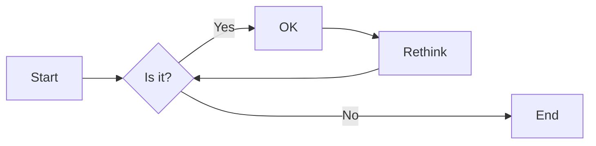
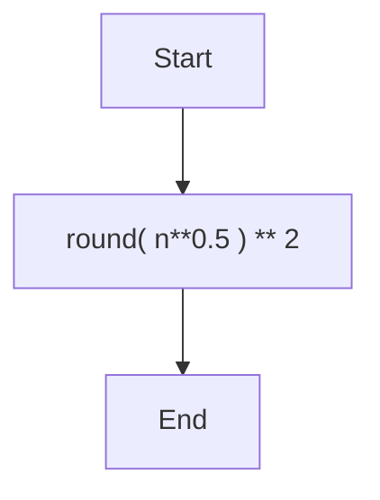
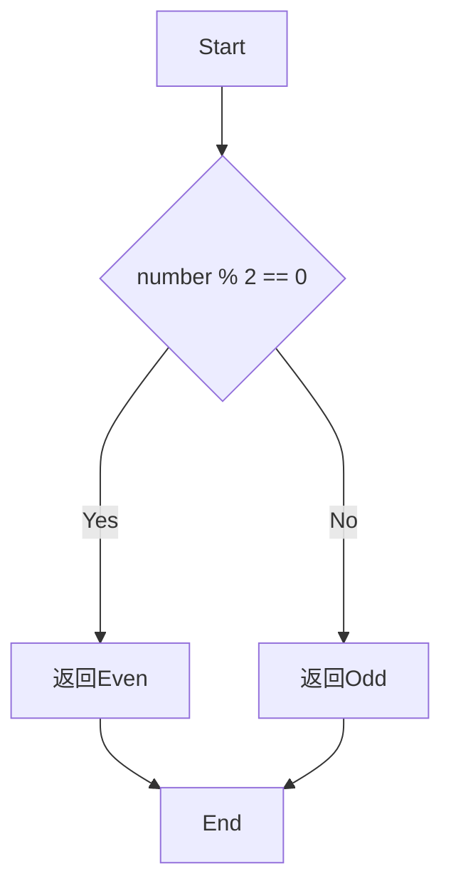

# 实验二 Python变量、简单数据类型

班级： 21计科2班

学号： B20210906220

姓名： 刘嘉璐

Github地址：<https://github.com/Yalerea/pyexperiments>

CodeWars地址：<https://www.codewars.com/users/pyelephant>

---

## 实验目的

1. 使用VSCode编写和运行Python程序
2. 学习Python变量和简单数据类型

## 实验环境

1. Git
2. Python 3.10
3. VSCode
4. VSCode插件

## 实验内容和步骤

### 第一部分

实验环境的安装

1. 安装Python，从Python官网下载Python 3.10安装包，下载后直接点击可以安装：[Python官网地址](https://www.python.org/downloads/)
2. 为了在VSCode集成环境下编写和运行Python程序，安装下列VScode插件
   - Python
   - Python Environment Manager
   - Python Indent
   - Python Extended
   - Python Docstring Generator
   - Jupyter
   - indent-rainbow
   - Jinja

---

### 第二部分

Python变量、简单数据类型和列表简介

完成教材《Python编程从入门到实践》下列章节的练习：

- 第2章 变量和简单数据类型

---

### 第三部分

在[Codewars网站](https://www.codewars.com)注册账号，完成下列Kata挑战：

---

#### 第1题：求离整数n最近的平方数（Find Nearest square number）

难度：8kyu

你的任务是找到一个正整数n的最近的平方数
例如，如果n=111，那么nearest_sq(n)（nearestSq(n)）等于121，因为111比100（10的平方）更接近121（11的平方）。
如果n已经是完全平方（例如n=144，n=81，等等），你需要直接返回n。
代码提交地址
<https://www.codewars.com/kata/5a805d8cafa10f8b930005ba>


---

#### 第2题：弹跳的球（Bouncing Balls）

难度：6kyu

一个孩子在一栋高楼的第N层玩球。这层楼离地面的高度h是已知的。他把球从窗口扔出去。球弹了起来,  例如:弹到其高度的三分之二（弹力为0.66）。他的母亲从离地面w米的窗户向外看,母亲会看到球在她的窗前经过多少次（包括球下落和反弹的时候）？

一个有效的实验必须满足三个条件：

- 参数 "h"（米）必须大于0
- 参数 "bounce "必须大于0且小于1
- 参数 “window "必须小于h。

如果以上三个条件都满足，返回一个正整数，否则返回-1。
**注意:只有当反弹球的高度严格大于窗口参数时，才能看到球。**
代码提交地址
<https://www.codewars.com/kata/5544c7a5cb454edb3c000047/train/python>

---

#### 第3题： 元音统计(Vowel Count)

难度： 7kyu

返回给定字符串中元音的数量（计数）。对于这个Kata，我们将考虑a、e、i、o、u作为元音（但不包括y）。输入的字符串将只由小写字母和/或空格组成。

代码提交地址：
<https://www.codewars.com/kata/54ff3102c1bad923760001f3>

---

#### 第4题：偶数或者奇数（Even or Odd）

难度：8kyu

创建一个函数接收一个整数作为参数，当整数为偶数时返回”Even”当整数位奇数时返回”Odd”。
代码提交地址：
<https://www.codewars.com/kata/53da3dbb4a5168369a0000fe>

### 第四部分

使用Mermaid绘制程序流程图

安装Mermaid的VSCode插件：

- Markdown Preview Mermaid Support
- Mermaid Markdown Syntax Highlighting

使用Markdown语法绘制你的程序绘制程序流程图（至少一个），Markdown代码如下：


显示效果如下：



查看Mermaid流程图语法-->[点击这里](https://mermaid.js.org/syntax/flowchart.html)

使用Markdown编辑器（例如VScode）编写本次实验的实验报告，包括[实验过程与结果](#实验过程与结果)、[实验考查](#实验考查)和[实验总结](#实验总结)，并将其导出为 **PDF格式** 来提交。

## 实验过程与结果

- [第二部分 Python变量、简单数据类型和列表简介](#第二部分)

```python
# 2.1
message1 = "Hello World"
print(message1)
# 结果
Hello World

# 2.2
message2 = "Hello World"
print(message2)
message2 = "Hello Python"
print(message2)
# 结果
Hello World
Hello Python

# 2.3
name3 = "Eric"
message3 = f"Hello {name3},would you like to learn some Python today?"
print(message3)
# 结果
Hello Eric,would you like to learn some Python today?

# 2.4
name4 = "john swift"
print(name4.lower())
print(name4.upper())
print(name4.title())
# 结果
john swift
JOHN SWIFT
John Swift

# 2.5
message5 = "Albert Einstein once said,\"A person who never made a mistake never tried anything new.\""
print(message5)
# 结果
Albert Einstein once said,"A person who never made a mistake never tried anything new."

# 2.6
name6 = "Albert Einstein"
message6 = "A person who never made a mistake never tried anything new."
message = f"{name6} once said,\"{message6}\""
print(message)
# 结果
Albert Einstein once said,"A person who never made a mistake never tried anything new."

# 2.7
name7 = "   Albert\tEinstein   \n"
print(name7)
print(name7.lstrip())
print(name7.rstrip())
print(name7.strip())
# 结果
   Albert       Einstein

Albert  Einstein

   Albert       Einstein
Albert  Einstein

# 2.8
filename8 = "python_notes.txt"
print(filename8.removesuffix(".txt"))
# 结果
python_notes

# 2.9
print(3+5)
print(10-2)
print(2*4)
print(16//2)
# 结果
8
8
8
8

# 2.10
number10 = 6
message10 = f"My favorite number is {number10}."
print(message10)
# 结果


# 2.11
# 程序1
# 编写四个表达式使用加减乘除运算输出数字8
print(3+5)
print(10-2)
print(2*4)
print(16//2) # 运用//运算符取整
# 程序2
# 输出自己最喜欢的数字
number10 = 6
message10 = f"My favorite number is {number10}."
print(message10)
# 结果
My favorite number is 6.

# 2.12
import this
# 结果
The Zen of Python, by Tim Peters

Beautiful is better than ugly.
Explicit is better than implicit.
Simple is better than complex.
Complex is better than complicated.
Flat is better than nested.
Sparse is better than dense.
Readability counts.
Special cases aren't special enough to break the rules.
Although practicality beats purity.
Errors should never pass silently.
Unless explicitly silenced.
In the face of ambiguity, refuse the temptation to guess.
There should be one-- and preferably only one --obvious way to do it.
Although that way may not be obvious at first unless you're Dutch.
Now is better than never.
Although never is often better than *right* now.
If the implementation is hard to explain, it's a bad idea.
If the implementation is easy to explain, it may be a good idea.
Namespaces are one honking great idea -- let's do more of those!
```

- [第三部分 Codewars Kata挑战](#第三部分)
 **第1题：求离整数n最近的平方数（Find Nearest square number）**
思路：将n开方,四舍五入求出最接近的整数，最后求平方。

```python
def nearest_sq(n):
    return round( n**0.5 )**2
```

**第2题：弹跳的球（Bouncing Balls）**
思路：在满足三个条件的情况下，小球至少经过一次窗口，每反弹超过一次窗口就加2，求和得出结果。

```python
def bouncing_ball(h, bounce, window):
    m = h
    t = 1
    if h <= 0 or bounce <= 0 or bounce >= 1 or window >= h:
        return -1
    else:
        while m*bounce > window:
            m = m*bounce
            t+=2
    return t
```

**第3题： 元音统计(Vowel Count)**
思路：利用for循环统计列表中元音字母的个数，累加求和。

```python
def get_count(sentence):
    count = 0
    for str in sentence:
        if str =='a' or str == 'e' or str == 'i' or str == 'o' or str == 'u':
            count+=1
    return count
```

**第4题：偶数或者奇数（Even or Odd）**
思路：利用奇偶数模2取余的结果不同，通过if-else语句判断求解。

```python
def even_or_odd(number):
    if number % 2 == 0:
        return "Even"
    else:
        return "Odd"
```

- [第四部分 使用Mermaid绘制程序流程图](#第四部分)

**第1题**



**第4题**



## 实验考查

请使用自己的语言并使用尽量简短代码示例回答下面的问题，这些问题将在实验检查时用于提问和答辩以及实际的操作。

1. Python中的简单数据类型有那些？我们可以对这些数据类型做哪些操作？
简单数据类型：
整数（int）、浮点数（float）、字符串（str）、布尔值（bool）、列表（list）、元组（tuple）、集合（set）、字典（dict）。      
我们可以对这些数据类型做如下操作：
整数（int）和浮点数（float）：  
加法、减法、乘法、除法等数学运算；比较操作（大于、小于、等于等）；类型转换（例如，将整数转换为浮点数）。    
字符串（str）：     
字符串拼接、重复、切片、索引；字符串长度获取；字符串查找、替换、分割；字符串格式化。    
布尔值（bool）：
条件判断（if语句中使用）；逻辑运算（与、或、非）。      
列表（list）；添加元素（append、insert等）；删除元素（remove、pop等）；列表索引、切片、长度获取；列表合并、重复；列表排序、反转。      
元组（tuple）：     
访问元素；元组合并、重复。
集合（set）：
添加元素（add）；删除元素（remove、discard等）；集合运算（并集、交集、差集等）。
字典（dict）：
添加键值对；删除键值对；查找键对应的值；遍历键值对；获取字典的键、值、键值对等。

2. 为什么说Python中的变量都是标签？
因为Python的变量不是直接存储数据值的容器，而是指向存储数据值的内存位置的引用。
当创建一个变量并将其赋值给某个值时，实际上是在内存中分配了一块存储空间，并将变量标签指向这个存储空间的地址。这意味着变量本身并不存储数据，而只是一个指向数据的引用。这种方式具有灵活性、节省内存、垃圾回收的特点。
这种变量作为标签的方式使Python非常灵活，并且更容易处理复杂的数据结构和对象。
但是，如果修改了一个可变对象（如列表）的内容，其他引用该对象的变量也会反映出这些更改，因为引用对象相同。

3. 有哪些方法可以提高Python代码的可读性？

+ 遵循PEP 8：PEP 8是Python的官方风格指南，包含了命名规范、缩进、空格和其他格式化规范。
+ 适当命名：为变量、函数和类选择有意义的命名，避免使用令人困惑的缩写或非标准缩写。
+ 使用文档字符串（docstrings）：为函数、类和模块编写文档字符串，描述它们的作用和用法。
+ 注释：在复杂的代码段前写明其目的和工作原理。但避免过度注释，有时代码本身的清晰性更重要。
+ 代码结构：避免长函数或长类，尽可能将代码分解成小块、功能明确的函数或方法。
+ 空行：使用空行分隔逻辑块，使代码更具结构性。
+ 避免直接使用数字：不要在代码中直接使用数字，而是将其命名为有意义的常量。
+ 使用列表、字典和集合推导式：可以使代码更简洁，但需要确保不牺牲可读性。
+ 错误处理：使用适当的异常处理机制，并提供有意义的错误消息。
+ 限制行长度：避免过长的代码行，使代码更易于阅读。
+ 避免使用全局变量：除非绝对必要，否则尽量避免使用全局变量，以减少函数和方法之间的依赖。
+ 代码复用：避免重复代码，通过函数或类来重用代码。
+ 避免深层嵌套：尽量减少if语句或循环的深层嵌套，考虑使用函数或早期返回来简化结构。
+ 定期进行代码审查和重构，以及获取同事或团队成员的反馈。
+ 遵循固定的项目结构：当项目规模增长时，保持一个固定和一致的目录和文件结构有助于其他开发者快速找到和理解代码。

## 实验总结

本次Python实验中，我学习了Python的变量、简单数据类型等。    
Python中的变量是用来存储数据的标识符。在Python中，无需显式声明变量的类型，可以直接为变量赋值。其中简单数据类型包括整数（int）、浮点数（float）、字符串（str）、布尔值（bool）等。这些数据类型用于存储不同类型的数据。    
通过第二部分对教材习题的练习编程，我熟悉了“变量和简单的数据类型”这一章节；第三部分中的四道 Codewars Kata挑战题使我了解如何使用python进行算法编程；第四部分中，我学会了如何使用Mermaid绘制程序流程图。