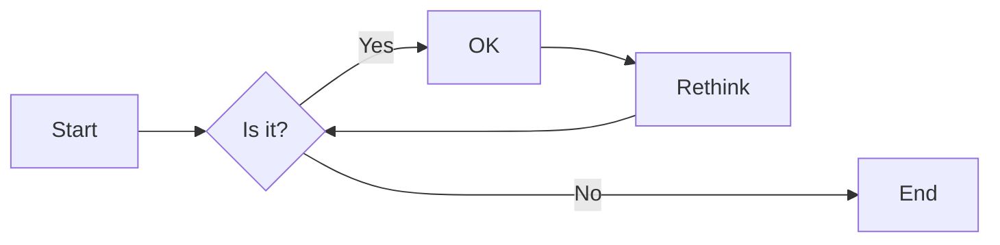
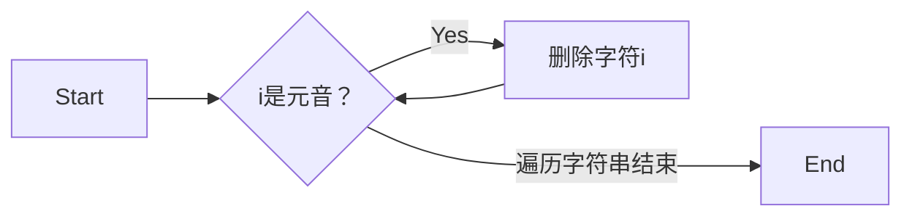

# 实验三 Python列表

班级： 21计科2班

学号： B20210906220

姓名： 刘嘉璐

Github地址：<https://github.com/Yalerea/pyexperiments>

CodeWars地址：<https://www.codewars.com/users/pyelephant>

---

## 实验目的

1. 学习Python的简单使用和列表操作
2. 学习Python中的if语句

## 实验环境

1. Git
2. Python 3.10
3. VSCode
4. VSCode插件

## 实验内容和步骤

### 第一部分

Python列表操作

完成教材《Python编程从入门到实践》下列章节的练习：

- 第3章 列表简介
- 第4章 操作列表
- 第5章 if语句

---

### 第二部分

在[Codewars网站](https://www.codewars.com)注册账号，完成下列Kata挑战：

---

#### 第一题：3和5的倍数（Multiples of 3 or 5）

难度： 6kyu

如果我们列出所有低于 10 的 3 或 5 倍数的自然数，我们得到 3、5、6 和 9。这些数的总和为 23. 完成一个函数，使其返回小于某个整数的所有是3 或 5 的倍数的数的总和。此外，如果数字为负数，则返回 0。

注意：如果一个数同时是3和5的倍数，应该只被算一次。

**提示：首先使用列表解析得到一个列表，元素全部是3或者5的倍数。
使用sum函数可以获取这个列表所有元素的和.**

代码提交地址：
<https://www.codewars.com/kata/514b92a657cdc65150000006>

---

#### 第二题： 重复字符的编码器（Duplicate Encoder）

难度： 6kyu

本练习的目的是将一个字符串转换为一个新的字符串，如果新字符串中的每个字符在原字符串中只出现一次，则为"("，如果该字符在原字符串中出现多次，则为")"。在判断一个字符是否是重复的时候，请忽略大写字母。

例如:

```python
"din"      =>  "((("
"recede"   =>  "()()()"
"Success"  =>  ")())())"
"(( @"     =>  "))(("
```

代码提交地址:
<https://www.codewars.com/kata/54b42f9314d9229fd6000d9c>

---

#### 第三题：括号匹配（Valid Braces）

难度：6kyu

写一个函数，接收一串括号，并确定括号的顺序是否有效。如果字符串是有效的，它应该返回True，如果是无效的，它应该返回False。
例如：

```python
"(){}[]" => True 
"([{}])" => True
 "(}" => False
 "[(])" => False 
"[({})](]" => False
```

**提示：
python中没有内置堆栈数据结构，可以直接使用`list`来作为堆栈，其中`append`方法用于入栈，`pop`方法可以出栈。**

代码提交地址
<https://www.codewars.com/kata/5277c8a221e209d3f6000b56>

---

#### 第四题： 从随机三元组中恢复秘密字符串(Recover a secret string from random triplets)

难度： 4kyu

有一个不为你所知的秘密字符串。给出一个随机三个字母的组合的集合，恢复原来的字符串。

这里的三个字母的组合被定义为三个字母的序列，每个字母在给定的字符串中出现在下一个字母之前。"whi "是字符串 "whatisup "的一个三个字母的组合。

作为一种简化，你可以假设没有一个字母在秘密字符串中出现超过一次。

对于给你的三个字母的组合，除了它们是有效的三个字母的组合以及它们包含足够的信息来推导出原始字符串之外，你可以不做任何假设。特别是，这意味着秘密字符串永远不会包含不出现在给你的三个字母的组合中的字母。

测试用例：

```python
secret = "whatisup"
triplets = [
  ['t','u','p'],
  ['w','h','i'],
  ['t','s','u'],
  ['a','t','s'],
  ['h','a','p'],
  ['t','i','s'],
  ['w','h','s']
]
test.assert_equals(recoverSecret(triplets), secret)
```

代码提交地址：
<https://www.codewars.com/kata/53f40dff5f9d31b813000774/train/python>

提示：

- 利用集合去掉`triplets`中的重复字母，得到字母集合`letters`，最后的`secret`应该由集合中的字母组成，`secret`长度也等于该集合。

```python
letters = {letter for triplet in triplets for letter in triplet }
length = len(letters)
```

- 创建函数`check_first_letter(triplets, first_letter)`，检测一个字母是不是secret的首字母，返回True或者False。
- 创建函数`remove_first_letter(triplets, first_letter)`,  从三元组中去掉首字母，返回新的三元组。
- 遍历字母集合letters，利用上面2个函数得到最后的结果`secret`。

---

#### 第五题： 去掉喷子的元音（Disemvowel Trolls）

难度： 7kyu

喷子正在攻击你的评论区!
处理这种情况的一个常见方法是删除喷子评论中的所有元音(字母：a,e,i,o,u)，以消除威胁。
你的任务是写一个函数，接收一个字符串并返回一个去除所有元音的新字符串。
例如，字符串 "This website is for losers LOL!"   将变成 "Ths wbst s fr lsrs LL!".

注意：对于这个Kata来说，y不被认为是元音。
代码提交地址：
<https://www.codewars.com/kata/52fba66badcd10859f00097e>

提示：

- 首先使用列表解析得到一个列表，列表中所有不是元音的字母。
- 使用字符串的join方法连结列表中所有的字母，例如：

```python
last_name = "lovelace"
letters = [letter for letter in last_name ]
print(letters) # ['l', 'o', 'v', 'e', 'l', 'a', 'c', 'e']
name = ''.join(letters) # name = "lovelace"
```

---

### 第三部分

使用Mermaid绘制程序流程图

安装VSCode插件：

- Markdown Preview Mermaid Support
- Mermaid Markdown Syntax Highlighting

使用Markdown语法绘制你的程序绘制程序流程图（至少一个），Markdown代码如下：


显示效果如下：



查看Mermaid流程图语法-->[点击这里](https://mermaid.js.org/syntax/flowchart.html)

使用Markdown编辑器（例如VScode）编写本次实验的实验报告，包括[实验过程与结果](#实验过程与结果)、[实验考查](#实验考查)和[实验总结](#实验总结)，并将其导出为 **PDF格式** 来提交。

## 实验过程与结果


- [第一部分 Python列表操作和if语句](#第一部分)
- 
**第三章**
```python
# 3.1
names = ['张三','李四','王五']
for name in names:
    print(name)

# 3.2
names = ['张三','李四','王五']
for name in names:
    print(f"{name}，你好！")

# 3.3
commutes = ['Honda motorcycle','walk']
for commute in commutes:
    print(f"I would like to own a {commute}.")

# 3.4
people = ['小a','小b','小c']
print(f"I want to have a dinner with {people[0]}、{people[1]}、{people[2]}.\n")

# 3.5
people = ['小a','小b','小c']
print(f"I want to have a dinner with {people[0]}、{people[1]}、{people[2]}.")
print(f"{people[1]} can not participate in the dinner.")
people[1] = '小h'
print(f"I want to have a dinner with {people[0]}、{people[1]}、{people[2]}.\n")

# 3.6
people = ['小a','小b','小c']
print(f"I want to have a dinner with {people[0]}、{people[1]}、{people[2]}.")
print(f"{people[1]} can not participate in the dinner.")
people[1] = '小h'
print(f"I want to have a dinner with {people[0]}、{people[1]}、{people[2]}.")
print("I have found a larger table to have a dinner.")
people.insert(0,'小s')
people.insert(len(people)//2,'小w')
people.append('小z')
print(f"I want to have a dinner with {people[0]}、{people[1]}、{people[2]}、{people[3]}、{people[4]}、{people[5]}.\n")

# 3.7
people = ['小a','小b','小c']
print(f"I want to have a dinner with {people[0]}、{people[1]}、{people[2]}.")
print(f"{people[1]} can not participate in the dinner.")
people[1] = '小h'
print(f"I want to have a dinner with {people[0]}、{people[1]}、{people[2]}.")
print("I have found a larger table to have a dinner.")
people.insert(0,'小s')
people.insert(len(people)//2,'小w')
people.append('小z')
print(f"I want to have a dinner with {people[0]}、{people[1]}、{people[2]}、{people[3]}、{people[4]}、{people[5]}.\n")
print("I am sorry to inform you that there is only two seats for guests.")
while(len(people)>2):
    h = people.pop()
    print(f"{h},I am sorry that I can not have a dinner with you this time.")
print(f"{people[0]},{people[1]},you are still invited.")
del people[1]
del people[0]
print(f"The content is here,{people}.")

# 3.8
pla = ['Paris','England','US','Australia','Singapore']
print(pla)
print(sorted(pla))
print(pla)
print(sorted(pla,reverse=True))
print(pla)
pla.reverse()
print(pla)
pla.reverse()
print(pla)
pla.sort()
print(pla)
pla.sort(reverse=True)
print(pla)

# 3.9
people = ['小a','小b','小c'] #3.4
print(f"I want to have a dinner with {people[0]}、{people[1]}、{people[2]}.")
print(len(people))

# 3.10
ev = ['mountain','lake','trees','moon','river','city']
print(ev[0])
print(ev[0].title())
print(ev[-1])
print(f"The list is {ev}.")
ev[0] = 'star'
print(ev)
ev.append('bear')
print(ev)
ev.insert(0,'ivy')
print(ev)
del ev[0]
print(ev)
ev.pop(-1)
print(ev)
ev.remove('city')
print(ev)
eve = ev
eve.sort()
print(eve)
eve.sort(reverse=True)
print(eve)
print(sorted(ev,reverse=True))
ev.reverse()
print(ev)
print(len(ev))

# 3.11
# print(ev[5]) # IndexError: list index out of range
print(ev[-1])
```

**第四章**
```python
# 4.1
pizzas = ['fruit','chicken','spicy']
for pizza in pizzas:
    print(pizza)
for pizza in pizzas:
    print(f"I like {pizza} pizza.")
print("I really love pizza!")

# 4.2
animals = ['fish','dog','duck']
for animal in animals:
    print(animal)
for animal in animals:
    print(f"A {animal} would make a great pet.")
print("Any of these animals would swim.")

# 4.3
for i in range(1,21):
    print(i)

# 4.4
num = list(range(1,1000001))
# for i in num:
#     print(i)

# 4.5
num = list(range(1,1000001))
print(min(num))
print(max(num))
print(sum(num))

# 4.6
num = list(range(1,20,2))
for i in num:
    print(i)

# 4.7
num7 = list(range(0,31,3))
for i in num7:
    print(i)

# 4.8
cube = []
for i in range(1,11):
    cube.append(i**3)
for j in cube:
    print(j)

# 4.9
cube = [i**3 for i in range(1,11)]
print(cube)

# P56
me = ['aa','cc','ff']
your = me[:]
you = me
me.append('dd')
you.append('oo')
your.append('ii')
print(me)
print(you)
print(your)

# 4.10
cube = [i**3 for i in range(1,11)]
print(cube)
print("The first three items in the list are:")
print(cube[:3])
print("Three items from the middle of the list are:")
print(cube[4:7])
print("The last three items in the list are:")
print(cube[-3:])

# 4.11
pizzas = ['fruit','chicken','spicy']
for pizza in pizzas:
    print(pizza)
for pizza in pizzas:
    print(f"I like {pizza} pizza.")
print("I really love pizza!")  ###
friend_pizza = pizzas[:]
pizzas.append('onion')
friend_pizza.append('cabbage')
print("My favorite pizzas are:")
for pizza in pizzas:
    print(pizza)
print("My friend's favorite pizzas are:")
for pizza in friend_pizza:
    print(pizza)

# 4.12
food = ['pizza','falafel','carrot cake']
friend_food = food[:]
for f in food:
    print(f)
for ff in friend_food:
    print(ff)

# 4.13
food = ('tea','egg','fish','beef','noodle')
for i in food:
    print(i)
# food[0] = 'chinken'
food = ('chicken','egg','fish','rice','noodle')
for i in food:
    print(i)
```

**第五章**
```python
# 5.1
car = 'aaa'
print("Is car == 'aa'?False.")
print(car == 'aa')
print("\nIs car == 'aaa'?True")
print(car == 'aaa')
print("\nIs car == 'Aaa'?True")
print(car.title() == 'Aaa')

# 5.2
a = 'aaa'
b = 'bbb'
print(a == b)
print(a != b)

c = 'Aaa'
print(a == c)
print(a.lower() == c)

print(3 == 5)
print(3 != 5)
print(3 > 5)
print(3 < 5)
print(3 >= 5)
print(3 <= 5)

print(3 == 3 and 5 > 3)
print(5 == 3 or 5 < 8)

print('a' in a)
print('b' not in a)
print('A' in c)
print('v' not in c)

# 5.3
alien_color = 'green'
if alien_color == 'green':
    print("5")
if alien_color == 'green':
    pass

# 5.4
alien_color = 'green'
if alien_color == 'green':
    print("5")
else:
    print("10")

# 5.5
alien_color = 'green'
if alien_color == 'green':
    print("5")
elif alien_color == 'yellow':
    print("10")
else:
    print('15')

# 5.10
current_users = ['a', 'C', 'bb', 'cCc', 'ddd']
new_users = ['m', 'n', 'ss', 'a', 'ccc']
user = []
for i in current_users:
    user.append(i.lower())
for j in new_users:
    if j in current_users:
        print("change it.")
    else:
        print("you can use.")

nums = list(range(1, 10))
for num in nums:
    if num == 1:
        print("1st")
    elif num == 2:
        print("2nd")
    elif num == 3:
        print("3rd")
    else:
        print(f"{num}th")
```

- [第二部分 Codewars Kata挑战](#第二部分)
**第一题**

思路：对于大于等于3的数字，遍历3到数字，如果数字能被3整除或者能被5整除，则将数字添加到变量m，最后返回总和m。
```python
def solution(number):
    s = number
    m = 0
    if s >= 3:
        for i in range(3,s):
            if (i%3 == 0 or i%5 == 0):
                m=m+i
    return m
```

**第二题**
思路：for循环遍历小写的字符串，判断每个字符在列表中出现的次数，如果为1，则添加'('到列表，如果大于1，则添加')'到列表，最后连接列表内容变为字符串并返回。

```python
def duplicate_encode(word):
    nn = []
    word = word.lower()
    for i in word:
        if word.count(i) == 1:
            nn.append('(')
        else:
            nn.append(')')
    return ''.join(nn)
```

**第三题**

思路：遍历字符串，如果字符`i`属于`'([{'`，则将字符串添加到列表，即压栈；如果属于`'])}'`，则在栈为空或者列表中弹出的字符与字符`i`不相等时，返回`False`。遍历结束后，若栈为空，返回`True`，否则返回`False`。

```python
def valid_braces(string):
    brace = {'{':'}','(':')','[':']'}
    stack = []
    for i in string:
        if i in '({[':
            stack.append(i)
        elif i in ')}]':
            if len(stack) == 0 or brace[stack.pop()] != i:
                return False
    return len(stack) == 0
```

**第四题**

思路：根据triplets通过集合生成原字符串的无重复字符列表t，循环遍历两次triplets，每次循环按三字符列表中的顺序调整string中的字符顺序，最后将string连成字符串返回。

```python
def recoverSecret(triplets):
    string = list(set(i for t in triplets for i in t))
    for t in triplets * 2:
        fix(string,t[1],t[2])
        fix(string,t[0],t[1])
    return ''.join(string)
def fix(a,m,n):
    if a.index(m)>a.index(n):
        a.remove(m)
        a.insert(a.index(n),m)
```

**第五题**

思路：将字符串用列表方式存储，遍历字符串，若字符i为元音，则将列表中的字符i删除，最后将列表连接成字符串返回。

```python
def disemvowel(string_):
    string = [i for t in string_ for i in t]
    for i in string_:
        if i.lower() in {'a','e','i','o','u'}:
            string.remove(i)
    string_ = ''.join(string)
    return string_
```

- [第三部分 使用Mermaid绘制程序流程图](#第三部分)   
**第五题**



## 实验考查

请使用自己的语言并使用尽量简短代码示例回答下面的问题，这些问题将在实验检查时用于提问和答辩以及实际的操作。

1. Python中的列表可以进行哪些操作？
1、添加元素：
append(item): 将元素添加到列表的末尾。
insert(index, item): 在指定索引位置插入元素。
2、移除元素：
remove(item): 移除列表中第一个匹配的元素。
pop(index): 移除并返回指定索引位置的元素。
3、访问元素：
通过索引访问元素，如 my_list[0] 访问第一个元素。
使用切片操作，如 my_list[1:4] 获取索引 1 到 3 的元素。
4、修改元素：
直接通过索引赋值来修改元素，如 my_list[0] = new_value。
5、列表合并：
使用 + 运算符合并两个列表。
6、列表复制：
使用 copy() 方法或切片 [:] 创建一个新的列表副本。
7、查找元素：
index(item): 查找元素在列表中的索引。
count(item): 统计元素在列表中的出现次数。
8、排序：
sort(): 对列表进行升序排序。
sorted_list = sorted(my_list): 创建一个新的排序后的列表。
9、逆序：
reverse(): 反转列表中的元素顺序。
10、长度和空判断：
len(my_list): 获取列表的长度。
not my_list: 检查列表是否为空。

2. 哪两种方法可以用来对Python的列表排序？这两种方法有和区别？
1、sort()方法：
sort() 是列表对象的方法，直接在原始列表上进行排序。
它会修改原始列表，而不创建新的列表。
默认情况下，sort()方法进行升序排序，使用reverse=True参数可以进行降序排序。
适用于对原列表进行就地排序。
2、sorted()方法：
sorted() 函数接受一个可迭代对象，返回一个新的已排序列表，而不影响原始列表，可以通过reverse=True参数实现降序排序。
适用于创建排序后的新列表，保留原始数据顺序。
区别：
主要区别在于sort()方法修改原列表，而sorted()函数创建一个新的已排序列表。函数的选择取决于是否需要保留原始列表和是否需要排序的列表。
  
3. 如何将Python列表逆序打印？
   使用切片（slice）的方式，具体步骤如下：

   ```python
   my_list = [1, 2, 3, 4, 5]
   reversed_list = my_list[::-1]  # 使用切片逆序列表
   print(reversed_list)  # 打印逆序后的列表
   ```
   
   使用`my_list[::-1]`切片来生成一个逆序的列表`reversed_list`。然后，通过`print()`函数将逆序后的列表打印出来。


4. Python中的列表执行哪些操作时效率比较高？哪些操作效率比较差？是否有类似的数据结构可以用来替代列表？

* 高效操作：
访问元素：通过索引访问元素方法高效，因为列表的元素是按索引存储的，时间复杂度为O(1)。
添加元素：在列表末尾使用append()方法添加元素是高效的，因为它平均时间复杂度为O(1)。但如果在列表的开始或指定位置插入元素，会导致其他元素的平均时间复杂度为O(n)。
* 相对低效操作：
插入或删除元素：在列表的中间或开始插入或删除元素，以及删除指定元素时，平均时间复杂度为O(n)，因为这可能需要移动其他元素。
查找元素：使用index()方法来查找元素，它需要遍历列表，平均时间复杂度为O(n)。
* 其他数据结构：
元组 (Tuple)：
元组是不可变的，一旦创建就不能更改。
如果需要存储不可修改的数据集合选择元组。
数组 (Array):
数组存储相同数据类型的元素，且具有固定大小。
如果需要高性能的数值计算，可以使用Python的array模块。
集合 (Set):
集合是一组唯一元素的无序集合，可以高效地检查元素是否存在，对于去重和查找操作非常有效。
双向链表 (collections.deque):
双向链表(deque)是一个双端队列，允许在列表的开头和末尾高效地执行插入和删除操作，可以进行高效的队列操作。
字典 (Dictionary):
字典是一种键-值映射的数据结构，用于存储关联数据。
如果需要将键与值相关联可以使用字典。
队列 (Queue):
Python标准库提供了queue模块，包括Queue和PriorityQueue，用于实现各种队列数据结构。
如果需要执行线程安全的队列操作，可以考虑使用。

1. 阅读《Fluent Python》Chapter 2. An Array of Sequence - Tuples Are Not Just Immutable Lists小节（p30-p35）。总结该小节的主要内容。
《Fluent Python》第2章的小节 "Tuples Are Not Just Immutable Lists" 主要强调了元组的不同于列表的特性和用途，以下是该小节的主要内容总结：
不可变性 (Immutability):
元组是不可变的，一旦创建后，无法更改其内容。这可以用于确保数据的稳定性和完整性。
元组与记录 (Tuples as Records):
元组可用于创建记录，其中每个元素表示不同的字段或属性。
使用元组来表示记录可以提高代码的可读性，并避免因错误更改数据。
元组解包 (Tuple Unpacking):
元组可以用于多个变量的同时赋值，这称为元组解包。
这允许在不使用临时变量的情况下互换变量的值，或者从函数返回多个值。
命名元组 (Named Tuples):
collections.namedtuple 允许创建具有字段名的元组，这样可以更容易地访问元组的元素。
命名元组可用于创建自定义数据类型，类似于面向对象编程中的类。
拆包 (Unpacking) 与 * 运算符:
使用 * 运算符可以将元组中的一部分元素拆包到新的元组中，这对于函数的变长参数传递非常有用。
元组的使用场景 (Use Cases for Tuples):
元组通常用于表示不可更改的有序集合，而列表用于可变的集合。
元组在字典的键中常常被使用，因为字典的键需要是不可变的对象。
总的来说，该小节强调了元组的不可变性和它们在表示记录和创建自定义数据类型方面的优势，以及如何使用元组解包和命名元组来提高代码的可读性和灵活性。元组是Python中非常有用的数据结构，特别适合不希望被修改的数据集合。

## 实验总结

总结一下这次实验你学习和使用到的知识，例如：编程工具的使用、数据结构、程序语言的语法、算法、编程技巧、编程思想。
通过本次实验，我有了以下收获：  
**Python的基础使用**： 我学会了如何创建、操作和使用Python的列表。列表是一种重要的数据结构，能够存储多个元素，并支持各种操作，如添加、删除和索引访问。   
**if语句的应用**： 我掌握了Python中的条件语句（if语句）的使用。if语句使我们能够根据不同的条件执行不同的代码块，有利于控制程序的流程。  
**for循环的应用**： 我掌握了Python中的for循环的使用。for循环使我们能够遍历一个序列（如列表或元组），并多次执行相同的代码块。    
通过codewars编程题的锻炼和流程图的编写，我对Python编程的基础有了更深刻的理解。这些知识和技能为之后的编程任务提供坚实的基础。