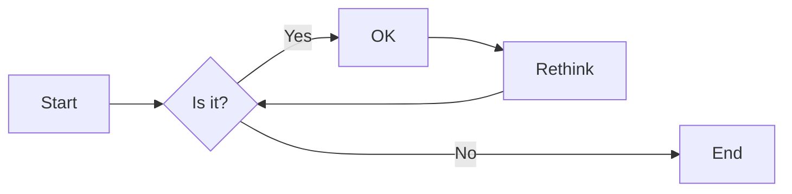
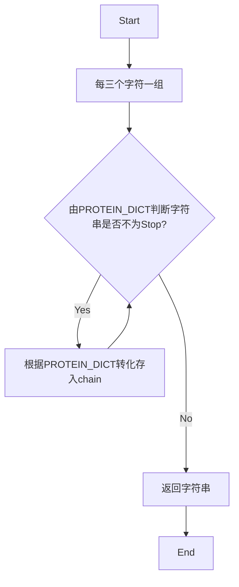

# 实验四 Python字典和while循环

班级： 21计科2

学号： B20210906220

姓名： 刘嘉璐

Github地址：<https://github.com/Yalerea/pyexperiments>

CodeWars地址：<https://www.codewars.com/users/pyelephant>

---

## 实验目的

1. 学习Python字典
2. 学习Python用户输入和while循环

## 实验环境

1. Git
2. Python 3.10
3. VSCode
4. VSCode插件

## 实验内容和步骤

### 第一部分

Python列表操作

完成教材《Python编程从入门到实践》下列章节的练习：

- 第6章 字典
- 第7章 用户输入和while循环

---

### 第二部分

在[Codewars网站](https://www.codewars.com)注册账号，完成下列Kata挑战：

---

#### 第一题：淘气还是乖孩子（Naughty or Nice）

难度： 7kyu

圣诞老人要来镇上了，他需要你帮助找出谁是淘气的或善良的。你将会得到一整年的JSON数据，按照这个格式：

```python
{
    January: {
        '1': 'Naughty','2': 'Naughty', ..., '31': 'Nice'
    },
    February: {
        '1': 'Nice','2': 'Naughty', ..., '28': 'Nice'
    },
    ...
    December: {
        '1': 'Nice','2': 'Nice', ..., '31': 'Naughty'
    }
}
```

你的函数应该返回 "Naughty!"或 "Nice!"，这取决于在某一年发生的总次数（以较大者为准）。如果两者相等，则返回 "Nice！"。
代码提交地址：
<https://www.codewars.com/kata/5662b14e0a1fb8320a00005c>

---

#### 第二题： 观察到的PIN（The observed PIN）

难度：4kyu

好了，侦探，我们的一个同事成功地观察到了我们的目标人物，抢劫犯罗比。我们跟踪他到了一个秘密仓库，我们认为在那里可以找到所有被盗的东西。这个仓库的门被一个电子密码锁所保护。不幸的是，我们的间谍不确定他看到的密码，当罗比进入它时。

键盘的布局如下：

```python
┌───┬───┬───┐
│ 1 │ 2 │ 3 │
├───┼───┼───┤
│ 4 │ 5 │ 6 │
├───┼───┼───┤
│ 7 │ 8 │ 9 │
└───┼───┼───┘
    │ 0 │
    └───┘
```

他注意到密码1357，但他也说，他看到的每个数字都有可能是另一个相邻的数字（水平或垂直，但不是对角线）。例如，代替1的也可能是2或4。而不是5，也可能是2、4、6或8。

他还提到，他知道这种锁。你可以无限制地输入错误的密码，但它们最终不会锁定系统或发出警报。这就是为什么我们可以尝试所有可能的（*）变化。

*可能的意义是：观察到的PIN码本身和考虑到相邻数字的所有变化。

你能帮助我们找到所有这些变化吗？如果有一个函数，能够返回一个列表，其中包含一个长度为1到8位的观察到的PIN的所有变化，那就更好了。我们可以把这个函数命名为getPINs（在python中为get_pins，在C#中为GetPINs）。

但请注意，所有的PINs，包括观察到的PINs和结果，都必须是字符串，因为有可能会有领先的 "0"。我们已经为你准备了一些测试案例。
侦探，我们就靠你了!
代码提交地址：
<https://www.codewars.com/kata/5263c6999e0f40dee200059d>

---

#### 第三题： RNA到蛋白质序列的翻译（RNA to Protein Sequence Translation）

难度：6kyu

蛋白质是由DNA转录成RNA，然后转译成蛋白质的中心法则。RNA和DNA一样，是由糖骨架（在这种情况下是核糖）连接在一起的长链核酸。每个由三个碱基组成的片段被称为密码子。称为核糖体的分子机器将RNA密码子转译成氨基酸链，称为多肽链，然后将其折叠成蛋白质。

蛋白质序列可以像DNA和RNA一样很容易地可视化，作为大字符串。重要的是要注意，“停止”密码子不编码特定的氨基酸。它们的唯一功能是停止蛋白质的转译，因此它们不会被纳入多肽链中。“停止”密码子不应出现在最终的蛋白质序列中。为了节省您许多不必要（和乏味）的键入，已为您的氨基酸字典提供了键和值。

给定一个RNA字符串，创建一个将RNA转译为蛋白质序列的函数。注意：测试用例将始终生成有效的字符串。

```python
protein（'UGCGAUGAAUGGGCUCGCUCC'）
```

将返回`CDEWARS`

作为测试用例的一部分是一个真实世界的例子！最后一个示例测试用例对应着一种叫做绿色荧光蛋白的蛋白质，一旦被剪切到另一个生物体的基因组中，像GFP这样的蛋白质可以让生物学家可视化细胞过程！

Amino Acid Dictionary

```python
   # Your dictionary is provided as PROTEIN_DICT
   PROTEIN_DICT = {
    # Phenylalanine
    'UUC': 'F', 'UUU': 'F',
    # Leucine
    'UUA': 'L', 'UUG': 'L', 'CUU': 'L', 'CUC': 'L', 'CUA': 'L', 'CUG': 'L',
    # Isoleucine
    'AUU': 'I', 'AUC': 'I', 'AUA': 'I',
    # Methionine
    'AUG': 'M',
    # Valine
    'GUU': 'V', 'GUC': 'V', 'GUA': 'V', 'GUG': 'V',
    # Serine
    'UCU': 'S', 'UCC': 'S', 'UCA': 'S', 'UCG': 'S', 'AGU': 'S', 'AGC': 'S',
    # Proline
    'CCU': 'P', 'CCC': 'P', 'CCA': 'P', 'CCG': 'P',
    # Threonine
    'ACU': 'T', 'ACC': 'T', 'ACA': 'T', 'ACG': 'T',
    # Alanine
    'GCU': 'A', 'GCC': 'A', 'GCA': 'A', 'GCG': 'A',
    # Tyrosine
    'UAU': 'Y', 'UAC': 'Y',
    # Histidine
    'CAU': 'H', 'CAC': 'H',
    # Glutamine
    'CAA': 'Q', 'CAG': 'Q',
    # Asparagine
    'AAU': 'N', 'AAC': 'N',
    # Lysine
    'AAA': 'K', 'AAG': 'K',
    # Aspartic Acid
    'GAU': 'D', 'GAC': 'D',
    # Glutamic Acid
    'GAA': 'E', 'GAG': 'E',
    # Cystine
    'UGU': 'C', 'UGC': 'C',
    # Tryptophan
    'UGG': 'W',
    # Arginine
    'CGU': 'R', 'CGC': 'R', 'CGA': 'R', 'CGG': 'R', 'AGA': 'R', 'AGG': 'R',
    # Glycine
    'GGU': 'G', 'GGC': 'G', 'GGA': 'G', 'GGG': 'G',
    # Stop codon
    'UAA': 'Stop', 'UGA': 'Stop', 'UAG': 'Stop'
}
```

代码提交地址：
<https://www.codewars.com/kata/555a03f259e2d1788c000077>

---

#### 第四题： 填写订单（Thinkful - Dictionary drills: Order filler）

难度：8kyu

您正在经营一家在线业务，您的一天中很大一部分时间都在处理订单。随着您的销量增加，这项工作占用了更多的时间，不幸的是最近您遇到了一个情况，您接受了一个订单，但无法履行。

您决定写一个名为`fillable()`的函数，它接受三个参数：一个表示您库存的字典`stock`，一个表示客户想要购买的商品的字符串`merch`，以及一个表示他们想购买的商品数量的整数n。如果您有足够的商品库存来完成销售，则函数应返回`True`，否则应返回`False`。

有效的数据将始终被传入，并且n将始终大于等于1。

代码提交地址：
<https://www.codewars.com/kata/586ee462d0982081bf001f07/python>

---

#### 第五题： 莫尔斯码解码器（Decode the Morse code, advanced）

难度： 4kyu

在这个作业中，你需要为有线电报编写一个莫尔斯码解码器。
有线电报通过一个有按键的双线路运行，当按下按键时，会连接线路，可以在远程站点上检测到。莫尔斯码将每个字符的传输编码为"点"（按下按键的短按）和"划"（按下按键的长按）的序列。

在传输莫尔斯码时，国际标准规定：

- "点" - 1个时间单位长。
- "划" - 3个时间单位长。
- 字符内点和划之间的暂停 - 1个时间单位长。
- 单词内字符之间的暂停 - 3个时间单位长。
- 单词间的暂停 - 7个时间单位长。

但是，该标准没有规定"时间单位"有多长。实际上，不同的操作员会以不同的速度进行传输。一个业余人士可能需要几秒钟才能传输一个字符，一位熟练的专业人士可以每分钟传输60个单词，而机器人发射器可能会快得多。

在这个作业中，我们假设消息的接收是由硬件自动执行的，硬件会定期检查线路，如果线路连接（远程站点的按键按下），则记录为1，如果线路未连接（远程按键弹起），则记录为0。消息完全接收后，它会以一个只包含0和1的字符串的形式传递给你进行解码。

例如，消息`HEY JUDE`，即`···· · −·−−   ·−−− ··− −·· ·`可以如下接收：

```python
1100110011001100000011000000111111001100111111001111110000000000000011001111110011111100111111000000110011001111110000001111110011001100000011
```

如您所见，根据标准，这个传输完全准确，硬件每个"点"采样了两次。

因此，你的任务是实现两个函数：

函数decodeBits(bits)，应该找出消息的传输速率，正确解码消息为点（.）、划（-）和空格（字符之间有一个空格，单词之间有三个空格），并将它们作为一个字符串返回。请注意，在消息的开头和结尾可能会出现一些额外的0，确保忽略它们。另外，如果你无法分辨特定的1序列是点还是划，请假设它是一个点。

函数decodeMorse(morseCode)，它将接收上一个函数的输出，并返回一个可读的字符串。

注意：出于编码目的，你必须使用ASCII字符.和-，而不是Unicode字符。

莫尔斯码表已经预加载给你了（请查看解决方案设置，以获取在你的语言中使用它的标识符）。

```python
morseCodes(".--")  #to access the morse translation of ".--"
```

下面是Morse码支持的完整字符列表：

```javascript
A    ·–
B    –···
C    –·–·
D    –··
E    ·
F    ··–·
G    ––·
H    ····
I    ··
J    ·–––
K    –·–
L    ·–··
M    ––
N    –·
O    –––
P    ·––·
Q    ––·–
R    ·–·
S    ···
T    –
U    ··–
V    ···–
W    ·––
X    –··–
Y    –·––
Z    ––··
0    –––––
1    ·––––
2    ··–––
3    ···––
4    ····–
5    ·····
6    –····
7    ––···
8    –––··
9    ––––·
.    ·–·–·–
,    ––··––
?    ··––··
'    ·––––·
!    –·–·––
/    –··–·
(    –·––·
)    –·––·–
&    ·–···
:    –––···
;    –·–·–·
=    –···–
+    ·–·–·
-    –····–
_    ··––·–
"    ·–··–·
$    ···–··–
@    ·––·–·
```

代码提交地址：
<https://www.codewars.com/kata/decode-the-morse-code-advanced>

---

### 第三部分

使用Mermaid绘制程序流程图

安装VSCode插件：

- Markdown Preview Mermaid Support
- Mermaid Markdown Syntax Highlighting

使用Markdown语法绘制你的程序绘制程序流程图（至少一个），Markdown代码如下：


显示效果如下：



查看Mermaid流程图语法-->[点击这里](https://mermaid.js.org/syntax/flowchart.html)

使用Markdown编辑器（例如VScode）编写本次实验的实验报告，包括[实验过程与结果](#实验过程与结果)、[实验考查](#实验考查)和[实验总结](#实验总结)，并将其导出为 **PDF格式** 来提交。

## 实验过程与结果


- [第一部分 Python列表操作和if语句](#第一部分)

- 第6章 字典
  
```python
# 6.1
people = { 'first_name':'Taylor','last_name':'Swift','age':22,'city':'NewYork'}
print(people)

# 6.2
num={'a':3,'b':4, 'c':5,'d':6, 'e':7}
print(num)

# 6.3
dic = {'code':'代码','dic':'字典','item':'迭代器','algorithmn':'算法','list':'列表'}
print(dic)

# 6.4
dic = {'code':'代码','dic':'字典','item':'迭代器','algorithmn':'算法','list':'列表'}
for key,value in dic.items():
    print(key,value)
dic['sort']='排序'
dic['del']='删除'
dic['add']='添加'
dic['remove']='删除'
dic['append']='添加'
for key,value in dic.items():
    print(key,value)
    
# 6.5
river = {'nile':'egypt','yangtze':'china','mississippi':'usa'}
for k,v in river.items():
    print(f"The {k.title()} runs through {v.title()}.")
    print(k.title())
    print(v.title())
    
# 6.6
visitor = ['jen','sarah','ivy','john']
favorite_language = {'jen':'python','sarah':'c','edward':'rust','phil':'python'}
for k,v in favorite_language.items():
    if k in visitor:
        print(f"{k.title()}, thank you for coming!")
    else:
        print(f"{k.title()}, can you participate in?")
        
# 6.7
people1 = { 'first_name':'Taylor','last_name':'Swift','age':22,'city':'NewYork'}
people2 = { 'first_name':'aa','last_name':'ss','age':12,'city':'London'}
people3 = { 'first_name':'rr','last_name':'ww','age':23,'city':'Beijing'}
people = [people1,people2,people3]
for i in people:
    print(i)
    
# 6.8
a = {'type':'dog','hostname':'June'}
b = {'type':'cat','hostname':'Ivy'}
c = {'type':'fish','hostname':'Jack'}
pets = [a,b,c]
for i in pets:
    print(i)
    
# 6.9
favorite_places = {
    'jen':['san francisco','texas','london'],
    'sarah':['paris','tokyo'],
    'edward':['chicago'],
}
favorite_places['sarah'].append('seattle')
for k,v in favorite_places.items():
    print(f"{k.title()}'s favorite places are:")
    for i in v:
        print(i.title())

# 6.10
num={'a':[3,1,5],'b':[5,6], 'c':[10,4,8],'d':[5], 'e':[22,11,0]}
for k,v in num.items():
    print(f"{k.title()}")
    for i in v:
        print(i)

# 6.11
cities = {
    'NewYork':{'country':'USA','population':10000000,'fact':'New York is the capital of USA'},
    'London':{'country':'UK','population':10000000,'fact':'London is the capital of UK'},
    'Beijing':{'country':'China','population':10000000,'fact':'Beijing is the capital of China'}
}
for k,v in cities.items():
    print(f"{k.title()}")
    print(f"{v['country']}")
    print(f"{v['population']}")
    print(f"{v['fact']}")
    print('\n')
    
# 6.12
num={'a':3,'b':4, 'c':5,'d':6, 'e':7}
print(num)
num['a']=9
num['v']=8
for k,v in num.items():
    print(k.title())
    print(v)
```

- 第7章 用户输入和while循环

```python
# 7.1
# message = input("What kind of cars would you like?")
# print(f"Let me see if I can find you a {message}.")

# 7.2
# message = input("How many customers?")
# message = int(message)
# if message >8:
#     print("No seat.")
# else:
#     print("There are seats.")

# 7.3
# num = input("number:")
# num = int(num)
# if num%10==0:
#     print("能被十整除。")
# else:
#     print("不能被十整除。")

# 7.4
# message = ""
# while message != "quit":
#     message = input("Please add:")
#     if message != "quit":
#         print(f"Pizza add {message}")
        
# 7.5
# while True:
#     age = input("How old are you?")
#     age = int(age)
#     if age<3:
#         print("free")
#     elif age<12:
#         print("10 dollars")
#     else:
#         print("15 dollars")

# 7.6
# while True:
#     active = input("What do you want to add?")
#     if active != "quit":
#         print(f"Pizza add {active}")
#     else:
#         break
# message = ""
# while message != "quit":
#     message = input("Please add:")
#     if message != "quit":
#         print(f"Pizza add {message}")
# 7.7
# while 1:
#     print(111111111111111)
    
# 7.8
# sandwich_orders = ['milk','sugar','fruit','egg']
# finished_sandwiches = []
# while sandwich_orders:
#     now = sandwich_orders.pop()
#     print(f"I made you {now} sandwich.")
#     finished_sandwiches.append(now)
# print(finished_sandwiches)

# 7.9
# sandwich_orders = ['milk','pastrami','sugar','pastrami','pastrami','fruit','egg']
# print("The pastrami sandwich has been sold out.")
# while 'pastrami' in sandwich_orders:
#     sandwich_orders.remove('pastrami')
# print(sandwich_orders)

# 7.10
places = []
dream = ""
while True:
    dream = input("If you could visit one place in the world,where would you go?")
    if dream != "quit":
        places.append(dream)
    else:
        break
print(places)
```

- [第二部分 Codewars Kata挑战](#第二部分)

第一题：
思路：遍历`data`字典，如果`data[month][day]`的值为`'Nice'`，则`nice`加1，否则`naughty`加1。比较`nice`和`naughty`的大小，如果`nice`大于`naughty`，则返回`'Nice!'`，否则返回`'Naughty!'`。

```python
nice = 0
naughty = 0
for month in data:
    for day in data[month]:
        if data[month][day] == 'Nice':
            nice += 1
        else:
            naughty += 1
if nice >= naughty:
    return 'Nice!'
else:
    return 'Naughty!'
```

第二题：
思路：构建字典key，将每个数字可能取到的值存入，由输入得到二维数组，用`*`降为一维数组，之后使用`product`函数得到所有不重复组合，最后转化为字符串。

```python
from itertools import product
from itertools import product
def get_pins(observed):
    key = {
            "1" : ["1", "2", "4"],
            "2" : ["1", "2", "3", "5"],
            "3" : ["2", "3", "6"],
            "4" : ["1", "4", "5", "7"],
            "5" : ["2", "4", "5", "6", "8"],
            "6" : ["3", "5", "6", "9"],
            "7" : ["4", "7", "8"],
            "8" : ["5", "7", "8", "9", "0"],
            "9" : ["6", "8", "9"],
            "0" : ["8", "0"]
    }
    list = [ key[ch] for ch in observed]
    return [''.join(item) for item in product(*list)]
```

第三题：
思路：将字符串每三个分为一组，根据已给字典`PROTEIN_DICT`判断每个字符串是否为`Stop`，如果不是则转化后放入列表`chain`，否则返回字符串。

```python
lists = [rna[i:i+3] for i in range(0, len(rna), 3)]
chain = []
for list in lists:
    if PROTEIN_DICT[list] != 'Stop':
        chain.append(PROTEIN_DICT[list])
    else:
        break
return ''.join(chain)
```

第四题：
思路：使用`get`方法，并令不存在的商品库存为0，之后将库存和n进行比较，如果库存大于等于n，则返回`True`，否则返回`False`。

```python
return stock.get(merch,0)>=n
```

第五题：
思路：`decode_bits()`函数将所给字符串首尾的`0`去除，判断`0`不在字符串中的情况，取最小的连续`1`和连续`0`中的最小长度，之后将二进制字符串转化为摩斯电码；`decode_morse()`函数将摩斯电码转化为字符串。

```python
MORSE_CODE['_'] = ' '
def decode_bits(bits):
    bits = bits.strip('0')
    
    if '0' not in bits:
        return '.'
    
    minone = min(len(one) for one in bits.split('0') if one)
    minzero = min(len(zero) for zero in bits.split('1') if zero)
    m = min(minone,minzero)
    
    return bits.replace('111'*m, '-').replace('000000'*m,' _ ').replace('000'*m, ' ').replace('1'*m, '.').replace('0'*m, '')

def decode_morse(morseCode):
    return ''.join(MORSE_CODE[c] for c in morseCode.split())
```

- [第三部分 使用Mermaid绘制程序流程图](#第三部分)

第三题：    
思路：将字符串每三个分为一组，根据已给字典`PROTEIN_DICT`判断每个字符串是否为`Stop`，如果不是则放入列表`chain`，否则返回字符串。



## 实验考查

请使用自己的语言并使用尽量简短代码示例回答下面的问题，这些问题将在实验检查时用于提问和答辩以及实际的操作。

1. 字典的键和值有什么区别？     
字典是一种无序的数据结构，它由键（key）和值（value）组成。键和值在字典中是一一对应的关系。   
键是字典中用于唯一标识和索引值的部分，它必须是不可变的数据类型，例如字符串、整数或元组。每个键在字典中必须是唯一的，如果尝试使用相同的键插入多个值，后面的值会覆盖前面的值。    
值是与键相关联的数据，可以是任何数据类型，包括字符串、整数、列表、字典等。值可以重复，不同的键可以对应相同的值。    
总结来说，字典的键用于唯一标识和索引值，而值是与键相关联的数据。通过键可以快速查找和访问对应的值。  
1. 在读取和写入字典时，需要使用默认值可以使用什么方法？

在读取和写入字典时，为了避免出现键不存在的情况，可以使用以下方法来设置默认值：   
使用get()方法：get()方法允许你根据键来获取字典中的值，如果键不存在，它将返回一个指定的默认值。例如  

```python
my_dict = {'a': 1, 'b': 2}
value = my_dict.get('c', 0)  # 如果键'c'不存在，则返回0
```
使用setdefault()方法：setdefault()方法可以用来获取字典中的值，如果键不存在，它会设置该键的默认值并返回。例如：
        
```python
my_dict = {'a': 1, 'b': 2}
value = my_dict.setdefault('c', 0)  # 如果键'c'不存在，则设置'c'的值为0，并返回0
```

使用字典的defaultdict：collections 模块中的 defaultdict 可以创建一个默认值为特定类型的字典。这个默认值在访问不存在的键时会自动添加到字典中。例如：
        
```python
from collections import defaultdict
my_dict = defaultdict(int)  # 默认值为0的字典
value = my_dict['c']  # 如果键'c'不存在，会自动创建并赋值为0
```

这些方法可以避免出现KeyError异常。

3. Python中的while循环和for循环有什么区别？     
   

while循环是一种条件循环，它会根据给定的条件重复执行一段代码，直到条件不再满足为止。在每次循环迭代时，会先判断条件是否为真，如果为真，则执行循环体中的代码，然后再次判断条件。如果条件仍然为真，循环会继续执行，直到条件为假时循环结束。     
for循环是一种迭代循环，它可以遍历一个可迭代对象（如列表、元组、字符串等）中的每个元素，并执行相应的代码。在每次循环迭代时，变量会依次取得可迭代对象中的每个元素，并执行循环体中的代码。当所有元素都被遍历完后，循环结束。   
因此，while循环适用于需要根据条件来控制循环执行的情况，而for循环适用于需要遍历可迭代对象的

1. 阅读[PEP 636 – Structural Pattern Matching: Tutorial](https://peps.python.org/pep-0636/), 总结Python 3.10中新出现的match语句的使用方法。

`match` 语句采用表达式并将其值与连续 模式作为一个或多个案例块给出。

最简单的形式是将主题值与一个或多个文本进行比较：

```python
def http_error(status):
    match status:
        case 400:
            return "Bad request"
        case 404:
            return "Not found"
        case 418:
            return "I'm a teapot"
        case _:
            return "Something's wrong with the Internet"
```

最后一个块：“变量名”充当通配符和 永远不会失败匹配。`_`

可以使用` ("or")` 将多个文本组合到单个模式中：`|`

`case 401 | 403 | 404:
    return "Not allowed"`
模式可以看起来像解包分配，并可用于绑定 变量：
```python
# point is an (x, y) tuple
match point:
    case (0, 0):
        print("Origin")
    case (0, y):
        print(f"Y={y}")
    case (x, 0):
        print(f"X={x}")
    case (x, y):
        print(f"X={x}, Y={y}")
    case _:
        raise ValueError("Not a point")
```

第一个模式有两个文字，并且可以 被认为是上面显示的文字模式的扩展。但接下来的两个模式组合了一个文本和一个变量，并且 变量绑定来自`subject()`的值。第四个模式捕获两个值，在概念上类似于解包作业：`point(x, y) = point`

如果使用类来构建数据 可以使用类名后跟类似于构造函数，但能够将属性捕获到变量中：

```python
from dataclasses import dataclass

@dataclass
class Point:
    x: int
    y: int

def where_is(point):
    match point:
        case Point(x=0, y=0):
            print("Origin")
        case Point(x=0, y=y):
            print(f"Y={y}")
        case Point(x=x, y=0):
            print(f"X={x}")
        case Point():
            print("Somewhere else")
        case _:
            print("Not a point")
```

您可以将位置参数与一些内置类一起使用，这些类为其属性（例如数据类）提供排序。您还可以通过在类中设置特殊属性来定义模式中属性的特定位置。如果设置为`（“x”，“y”）`，则以下模式都是等效的（并且都将属性绑定到变量）：

```python
__match_args__yvar

Point(1, var)
Point(1, y=var)
Point(x=1, y=var)
Point(y=var, x=1)
```

模式可以任意嵌套。例如，如果我们有一个简短的积分列表，我们可以这样匹配：

```python
match points:
    case []:
        print("No points")
    case [Point(0, 0)]:
        print("The origin")
    case [Point(x, y)]:
        print(f"Single point {x}, {y}")
    case [Point(0, y1), Point(0, y2)]:
        print(f"Two on the Y axis at {y1}, {y2}")
    case _:
        print("Something else")
```

我们可以在模式中添加一个子句，称为`"guard"`。如果`guard`是假的，继续尝试下一个案例块。注意该值捕获发生在评估`guard`之前：`ifmatch`

```python
match point:
    case Point(x, y) if x == y:
        print(f"Y=X at {x}")
    case Point(x, y):
        print(f"Not on the diagonal")
```

其他几个主要功能：

与拆包赋值一样，元组和列表模式具有完全相同的含义，并且实际上匹配任意序列。一个重要的例外是它们与迭代器或字符串不匹配。（从技术上讲，主题必须是`.`的实例）`collections.abc.Sequence`

序列模式支持通配符：其作用类似于拆包分配中的通配符。后面的名称也可能是，因此匹配至少两个项目的序列，而不绑定其余项目。`[x，y，*rest]（x，y、*rest）*_（x、y、*_）`

映射模式：从`dict`中捕获和值。与序列模式不同，额外的键被忽略。还支持通配符。（但这是多余的，所以它是不允许的。）`{"bandwidth": b, "latency": l}"bandwidth""latency"**rest**_`

可以使用关键字捕获子模式：`as`

```python
case (Point(x1, y1), Point(x2, y2) as p2): ...
```

大多数字面量都是通过平等来比较的，而单身汉则是通过身份来比较的。`True False None`

模式可以使用命名常量。这些名称必须被点号的命名，以防止它们被解释为捕获变量：

```python
from enum import Enum
class Color(Enum):
    RED = 0
    GREEN = 1
    BLUE = 2

match color:
    case Color.RED:
        print("I see red!")
    case Color.GREEN:
        print("Grass is green")
    case Color.BLUE:
        print("I'm feeling the blues :(")
```

## 实验总结

本次实验我学习了字典以及用户输入和while循环的相关内容。字典由键和值组成，具有一一对应的关系；用户的输入通过input()方式实现；while循环可以实现循环语句，直到条件不满足时停止循环。此外，五道编程题使我了解到`*`的降维作用，`product`函数可以得到所有不重复的组合，以及字典中的get()可以设置默认值。通过查阅相关资料，我还了解了Python 3.10中新出现的match语句的使用方法。