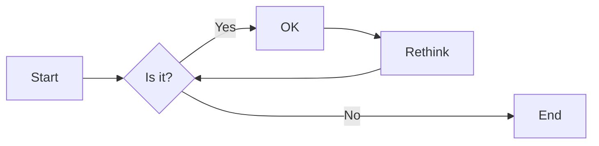
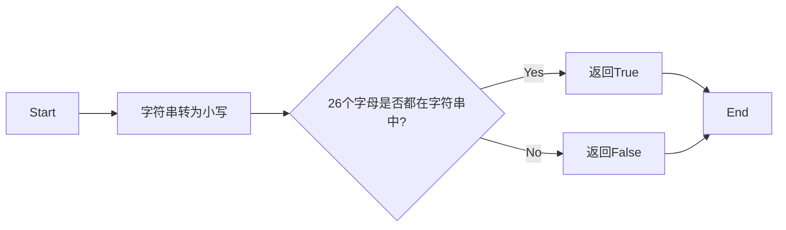

# 实验五 Python数据结构与数据模型

班级： 21计科2

学号： B20210906220

姓名： 刘嘉璐

Github地址：<https://github.com/Yalerea/pyexperiments>

CodeWars地址：<https://www.codewars.com/users/pyelephant>

---

## 实验目的

1. 学习Python数据结构的高级用法
2. 学习Python的数据模型

## 实验环境

1. Git
2. Python 3.10
3. VSCode
4. VSCode插件

## 实验内容和步骤

### 第一部分

在[Codewars网站](https://www.codewars.com)注册账号，完成下列Kata挑战：

---

#### 第一题：停止逆转我的单词

难度： 6kyu

编写一个函数，接收一个或多个单词的字符串，并返回相同的字符串，但所有5个或更多的字母单词都是相反的（就像这个Kata的名字一样）。传入的字符串将只由字母和空格组成。只有当出现一个以上的单词时，才会包括空格。
例如：

```python
spinWords( "Hey fellow warriors" ) => returns "Hey wollef sroirraw" 
spinWords( "This is a test") => returns "This is a test" 
spinWords( "This is another test" )=> returns "This is rehtona test"
```

代码提交地址：
<https://www.codewars.com/kata/5264d2b162488dc400000001>

提示：

- 利用str的split方法可以将字符串分为单词列表
例如：

```python
words = "hey fellow warrior".split()
# words should be ['hey', 'fellow', 'warrior']
```

- 利用列表推导将长度大于等于5的单词反转(利用切片word[::-1])
- 最后使用str的join方法连结列表中的单词。

---

#### 第二题： 发现离群的数(Find The Parity Outlier)

难度：6kyu

给你一个包含整数的数组（其长度至少为3，但可能非常大）。该数组要么完全由奇数组成，要么完全由偶数组成，除了一个整数N。请写一个方法，以该数组为参数，返回这个 "离群 "的N。

例如：

```python
[2, 4, 0, 100, 4, 11, 2602, 36]
# Should return: 11 (the only odd number)

[160, 3, 1719, 19, 11, 13, -21]
# Should return: 160 (the only even number)
```

代码提交地址：
<https://www.codewars.com/kata/5526fc09a1bbd946250002dc>

---

#### 第三题： 检测Pangram

难度：6kyu

pangram是一个至少包含每个字母一次的句子。例如，"The quick brown fox jumps over the lazy dog "这个句子就是一个pangram，因为它至少使用了一次字母A-Z（大小写不相关）。

给定一个字符串，检测它是否是一个pangram。如果是则返回`True`，如果不是则返回`False`。忽略数字和标点符号。
代码提交地址：
<https://www.codewars.com/kata/545cedaa9943f7fe7b000048>

---

#### 第四题： 数独解决方案验证

难度：6kyu

数独背景

数独是一种在 9x9 网格上进行的游戏。游戏的目标是用 1 到 9 的数字填充网格的所有单元格，以便每一列、每一行和九个 3x3 子网格（也称为块）中的都包含数字 1 到 9。更多信息请访问：<http://en.wikipedia.org/wiki/Sudoku>

编写一个函数接受一个代表数独板的二维数组，如果它是一个有效的解决方案则返回 true，否则返回 false。数独板的单元格也可能包含 0，这将代表空单元格。包含一个或多个零的棋盘被认为是无效的解决方案。棋盘总是 9 x 9 格，每个格只包含 0 到 9 之间的整数。

代码提交地址：
<https://www.codewars.com/kata/63d1bac72de941033dbf87ae>

---

#### 第五题： 疯狂的彩色三角形

难度： 2kyu

一个彩色的三角形是由一排颜色组成的，每一排都是红色、绿色或蓝色。连续的几行，每一行都比上一行少一种颜色，是通过考虑前一行中的两个相接触的颜色而产生的。如果这些颜色是相同的，那么新的一行就使用相同的颜色。如果它们不同，则在新的一行中使用缺失的颜色。这个过程一直持续到最后一行，只有一种颜色被生成。

例如：
```python
Colour here:            G G        B G        R G        B R
Becomes colour here:     G          R          B          G
```


一个更大的三角形例子：

```python
R R G B R G B B
 R B R G B R B
  G G B R G G
   G R G B G
    B B R R
     B G R
      R B
       G
```

你将得到三角形的第一行字符串，你的工作是返回最后的颜色，这将出现在最下面一行的字符串。在上面的例子中，你将得到 "RRGBRGBB"，你应该返回 "G"。
限制条件： 1 <= length(row) <= 10 ** 5
输入的字符串将只包含大写字母'B'、'G'或'R'。

例如：

```python
triangle('B') == 'B'
triangle('GB') == 'R'
triangle('RRR') == 'R'
triangle('RGBG') == 'B'
triangle('RBRGBRB') == 'G'
triangle('RBRGBRBGGRRRBGBBBGG') == 'G'
```

代码提交地址：
<https://www.codewars.com/kata/5a331ea7ee1aae8f24000175>

提示：请参考下面的链接，利用三进制的特点来进行计算。
<https://stackoverflow.com/questions/53585022/three-colors-triangles>

---

### 第二部分

使用Mermaid绘制程序流程图

安装VSCode插件：

- Markdown Preview Mermaid Support
- Mermaid Markdown Syntax Highlighting

使用Markdown语法绘制你的程序绘制程序流程图（至少一个），Markdown代码如下：


显示效果如下：



查看Mermaid流程图语法-->[点击这里](https://mermaid.js.org/syntax/flowchart.html)

使用Markdown编辑器（例如VScode）编写本次实验的实验报告，包括[实验过程与结果](#实验过程与结果)、[实验考查](#实验考查)和[实验总结](#实验总结)，并将其导出为 **PDF格式** 来提交。

## 实验过程与结果

请将实验过程与结果放在这里，包括：

- [第一部分 Codewars Kata挑战](#第一部分)

第一题：
```python
def spin_words(sentence):
    return " ".join(word[::-1] if len(word)>=5 else word  for word in sentence.split())
```

思路：首先将字符串按照空格分割成列表，遍历列表，如果字符串长度大于等于5，则反转字符串，否则不反转。最后将列表拼接成字符串返回。
  
第二题：
```python
def find_outlier(integers):
    odd = [i for i in integers if i%2 !=0]
    even = [i for i in integers if i%2 ==0]
    return odd[0] if len(odd)< len(even) else even[0]
```

思路：首先将列表中的数按照奇偶性分成两个列表，然后比较两个列表的长度，长度较小的列表的元素就是离群的数字，返回这个列表的第一个数。

第三题：

```python
def is_pangram(s):
    s = s.lower()
    for char in 'abcdefghijklmnopqrstuvwxyz':
        if char not in s:
            return False
    return True
```

思路：首先将字符串全部转换为小写，然后遍历26个字母，如果字母不在字符串中，则返回`False`，否则返回`True`。

第四题：

```python
def validate_sudoku(board):
    nums = set(range(1,10))
    for i in board:
        if set(i) != nums:
            return False
    for j in zip(* board):
        if j != nums:
            return False
    for i in range(0,7,3):
        for j in range(0,7,3):
            if nums != {board[x][y] for x in range(i,i+3) for y in range(j,j+3)}:
                return False
    return True
```

思路：首先设置`nums`集合为1-9，然后分别按行、按列、按每个小方块遍历二维数组，判断列表中的数字是否等于集合`nums`，如果不等于，则返回`False`，否则返回`True`。


第五题：

```python
def triangle(row):
    reduce = [3**i+1 for i in range(10)][::-1]
    
    color = {'GG':'G', 'BB':'B', 'RR':'R', 'BR':'G', 
            'BG':'R', 'GB':'R', 'GR':'B', 'RG':'B', 'RB':'G'}
    
    for length in reduce:
        while len(row)>=length:
            row = [color[row[i]+row[length+i-1]] for i in range(len(low)-length+1)]
    return row[0]
```

思路：首先设置`reduce`列表，存储3的10次幂倒序到1；然后设置`color`字典，存储颜色转换关系；最后遍历`reduce`列表，如果列表长度大于当前行长度，则将当前行转换为对应颜色。最后返回当前行第一个元素。


- [第二部分 使用Mermaid绘制程序流程图](#第二部分)

第三题：

思路：首先将字符串全部转换为小写，然后遍历26个字母，如果字母不在字符串中，则返回False，否则返回True。



## 实验考查

请使用自己的语言并使用尽量简短代码示例回答下面的问题，这些问题将在实验检查时用于提问和答辩以及实际的操作。

1. 集合（set）类型有什么特点？它和列表（list）类型有什么区别？

集合（set）类型的特点：

```python
# 创建一个集合
my_set = {1, 2, 3, 4, 5}

# 集合中的元素是唯一的，不允许重复
my_set = {1, 2, 2, 3, 3, 4, 5}  # 结果为 {1, 2, 3, 4, 5}，去除了重复的元素

# 集合是无序的，元素没有确定的顺序
print(my_set)  # 可能输出 {5, 1, 2, 3, 4} 或者其他不同的顺序

# 集合是可变的
my_set.add(6)  # 添加元素
my_set.remove(3)  # 删除元素

```

列表（list）类型的特点：

```python
# 创建一个列表
my_list = [1, 2, 3, 4, 5]

# 列表中的元素可以重复出现
my_list = [1, 2, 2, 3, 3, 4, 5]  # 结果为 [1, 2, 2, 3, 3, 4, 5]，保留了重复的元素

# 列表是有序的，元素按照插入的顺序排列
print(my_list)  # 输出 [1, 2, 2, 3, 3, 4, 5]

# 列表是可变的
my_list.append(6)  # 添加元素
my_list.remove(3)  # 删除元素

```

集合和列表的区别总结：

- 集合中的元素是唯一的，不允许重复；列表中的元素可以重复出现。
- 集合是无序的，元素没有确定的顺序；列表是有序的，元素按照插入的顺序排列。
- 集合是通过哈希表存储元素，具有快速的成员检测操作；列表是通过数组存储元素，支持索引和切片操作。
- 集合支持集合运算符操作，如交集、并集、差集等；列表支持索引和切片操作。
- 集合使用花括号 `{}` 或 `set() `函数表示；列表使用方括号` []` 表示。

2. 集合（set）类型主要有那些操作？

集合（set）类型主要有以下操作：

- 添加元素：
```python
my_set = {1, 2, 3}
my_set.add(4)
print(my_set)  # 输出 {1, 2, 3, 4}
```

- 删除元素：

```python
my_set = {1, 2, 3}
my_set.remove(2)
print(my_set)  # 输出 {1, 3}
```

- 检查元素是否存在：

```python
my_set = {1, 2, 3}
if 2 in my_set:
    print("2 exists in the set")
else:
    print("2 doesn't exist in the set")
```

- 求集合大小：

```python
my_set = {1, 2, 3}
size = len(my_set)
print(size)  # 输出 3
```

-求交集、并集、差集：

```python
set1 = {1, 2, 3}
set2 = {2, 3, 4}

intersection = set1 & set2  # 求交集
union = set1 | set2  # 求并集
difference = set1 - set2  # 求差集

print(intersection)  # 输出 {2, 3}
print(union)  # 输出 {1, 2, 3, 4}
print(difference)  # 输出 {1}
```

但是，集合是无序的，所以不能通过索引来访问集合中的元素。另外，集合是可变的对象。

3. 使用`*`操作符作用到列表上会产生什么效果？为什么不能使用`*`操作符作用到嵌套的列表上？使用简单的代码示例说明。

使用*操作符作用到列表上会将列表中的元素重复多次。

例如，假设有一个列表 my_list = [1, 2, 3]，可以使用*操作符将该列表中的元素重复两次：

```python
my_list = [1, 2, 3]
new_list = my_list * 2
print(new_list)  # 输出 [1, 2, 3, 1, 2, 3]
```

在这个例子中，new_list 包含了 my_list 中的元素重复两次的结果。
然而，不能直接使用`*`操作符作用到嵌套的列表上，这是因为`*`操作符只是简单地将列表中的元素复制多次，并不会复制嵌套的列表本身。

例如，假设有一个嵌套的列表 nested_list = [[1, 2], [3, 4]]，如果直接使用`*`操作符将其重复两次，会得到意外的结果：

```python
nested_list = [[1, 2], [3, 4]]
new_nested_list = nested_list * 2
print(new_nested_list)  # 输出 [[1, 2], [3, 4], [1, 2], [3, 4]]
```

在这个例子中，new_nested_list 并不是我们期望的结果，而是将 nested_list 中的嵌套列表 [1, 2] 和 [3, 4] 复制了两次。

如果需要在嵌套的列表上使用*操作符，可以借助列表推导式来实现：

```python
nested_list = [[1, 2], [3, 4]]
new_nested_list = [sublist * 2 for sublist in nested_list]
print(new_nested_list)  # 输出 [[1, 2, 1, 2], [3, 4, 3, 4]]
```

在这个例子中，通过列表推导式，我们将 nested_list 中的每个嵌套列表扩展了两倍，得到了期望的结果。

4. 总结列表,集合，字典的解析（comprehension）的使用方法。使用简单的代码示例说明。

列表解析（List Comprehension）是一种简化创建列表的方法，它可以使用一行代码生成一个新的列表。列表解析的基本语法是在方括号内使用表达式和循环来定义新列表的元素。

```python
new_list = [expression for item in iterable]
```

其中，expression 是用来生成新列表元素的表达式，item 是可迭代对象中的每个元素，iterable 是一个可迭代对象，例如列表、字符串或范围。

示例：

```python
# 生成一个包含1到5的平方的列表
squared_list = [x**2 for x in range(1, 6)]
print(squared_list)  # 输出 [1, 4, 9, 16, 25]
```

集合解析（Set Comprehension）与列表解析类似，但最终生成的是一个集合。集合解析使用花括号 {} 来表示，并且不允许重复的元素。

示例：

```python
# 生成一个包含1到5的平方的集合
squared_set = {x**2 for x in range(1, 6)}
print(squared_set)  # 输出 {1, 4, 9, 16, 25}
```

字典解析（Dictionary Comprehension）用于创建字典。字典解析使用花括号 {} 来表示，并且包含键值对的表达式。

示例：

```python
# 生成一个包含1到5的数字和它们的平方的字典
squared_dict = {x: x**2 for x in range(1, 6)}
print(squared_dict)  # 输出 {1: 1, 2: 4, 3: 9, 4: 16, 5: 25}
```

通过列表解析、集合解析和字典解析，可以简洁地创建新的数据结构，避免使用显式的循环和临时变量。这种方法不仅提高了代码的可读性，同时也提升了代码的执行效率。

## 实验总结

本次实验我了解了Python数据结构与数据模型(字符串)。

通过对五道编程题的学习，我了解到字符串的分割、倒序、小写等，也了解了数独如何通过二维数组的方式进行按行、按列、按小方块遍历，同时在第五题了解到编程和数学的结合运用。通过对思考题的解答，我明白了集合（set）类型的特点，它和列表（list）类型的区别，以及集合的基本操作。此外，我了解到`*`操作符的使用方法,使用`*`操作符作用到列表上会将列表中的元素重复多次。最后，我学习了集合、列表、字典的解析的使用方法。

总之，我更加了解了Python语言的语法，以及如何使用Python语言来解决实际问题。