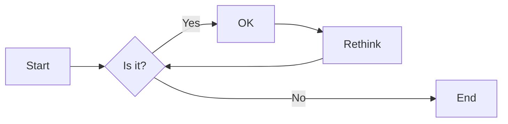
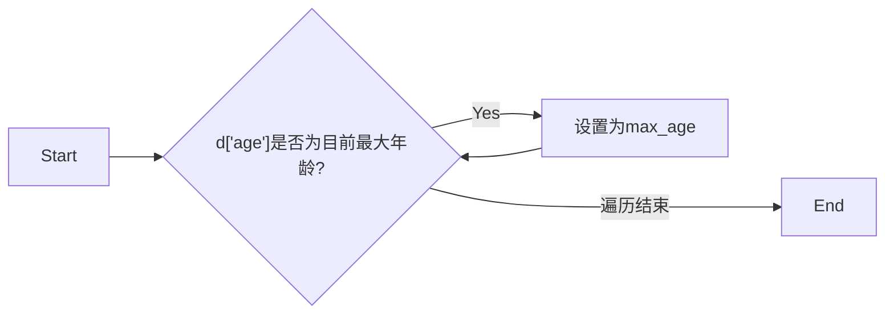

# 实验六 Python函数

班级： 21计科2

学号： B20210906220

姓名： 刘嘉璐

Github地址：<https://github.com/Yalerea/pyexperiments>

CodeWars地址：<https://www.codewars.com/users/pyelephant>

---

## 实验目的

1. 学习Python函数的基本用法
2. 学习lambda函数和高阶函数的使用
3. 掌握函数式编程的概念和实践

## 实验环境

1. Git
2. Python 3.10
3. VSCode
4. VSCode插件

## 实验内容和步骤

### 第一部分

Python函数

完成教材《Python编程从入门到实践》下列章节的练习：

- 第8章 函数

---

### 第二部分

在[Codewars网站](https://www.codewars.com)注册账号，完成下列Kata挑战：

---

#### 第一题：编码聚会1

难度： 7kyu

你将得到一个字典数组，代表关于首次报名参加你所组织的编码聚会的开发者的数据。
你的任务是返回来自欧洲的JavaScript开发者的数量。
例如，给定以下列表：

```python
lst1 = [
  { 'firstName': 'Noah', 'lastName': 'M.', 'country': 'Switzerland', 'continent': 'Europe', 'age': 19, 'language': 'JavaScript' },
  { 'firstName': 'Maia', 'lastName': 'S.', 'country': 'Tahiti', 'continent': 'Oceania', 'age': 28, 'language': 'JavaScript' },
  { 'firstName': 'Shufen', 'lastName': 'L.', 'country': 'Taiwan', 'continent': 'Asia', 'age': 35, 'language': 'HTML' },
  { 'firstName': 'Sumayah', 'lastName': 'M.', 'country': 'Tajikistan', 'continent': 'Asia', 'age': 30, 'language': 'CSS' }
]
```

你的函数应该返回数字1。
如果，没有来自欧洲的JavaScript开发人员，那么你的函数应该返回0。

注意：
字符串的格式将总是"Europe"和"JavaScript"。
所有的数据将始终是有效的和统一的，如上面的例子。

这个卡塔是Coding Meetup系列的一部分，其中包括一些简短易行的卡塔，这些卡塔是为了让人们掌握高阶函数的使用。在Python中，这些方法包括：`filter`, `map`, `reduce`。当然也可以采用其他方法来解决这些卡塔。

[代码提交地址](https://www.codewars.com/kata/coding-meetup-number-1-higher-order-functions-series-count-the-number-of-javascript-developers-coming-from-europe)

---

#### 第二题： 使用函数进行计算

难度：5kyu

这次我们想用函数来写计算，并得到结果。让我们看一下一些例子：

```python
seven(times(five())) # must return 35
four(plus(nine())) # must return 13
eight(minus(three())) # must return 5
six(divided_by(two())) # must return 3
```

要求：

- 从0（"零"）到9（"九"）的每个数字都必须有一个函数。
- 必须有一个函数用于以下数学运算：加、减、乘、除。
- 每个计算都由一个操作和两个数字组成。
- 最外面的函数代表左边的操作数，最里面的函数代表右边的操作数。
- 除法应该是整数除法。

例如，下面的计算应该返回2，而不是2.666666...。

```python
eight(divided_by(three()))
```

代码提交地址：
<https://www.codewars.com/kata/525f3eda17c7cd9f9e000b39>

---

#### 第三题： 缩短数值的过滤器(Number Shortening Filter)

难度：6kyu

在这个kata中，我们将创建一个函数，它返回另一个缩短长数字的函数。给定一个初始值数组替换给定基数的 X 次方。如果返回函数的输入不是数字字符串，则应将输入本身作为字符串返回。

例子：

```python
filter1 = shorten_number(['','k','m'],1000)
filter1('234324') == '234k'
filter1('98234324') == '98m'
filter1([1,2,3]) == '[1,2,3]'
filter2 = shorten_number(['B','KB','MB','GB'],1024)
filter2('32') == '32B'
filter2('2100') == '2KB';
filter2('pippi') == 'pippi'
```

代码提交地址：
<https://www.codewars.com/kata/56b4af8ac6167012ec00006f>

---

#### 第四题： 编码聚会7

难度： 6kyu

您将获得一个对象序列，表示已注册参加您组织的下一个编程聚会的开发人员的数据。

您的任务是返回一个序列，其中包括最年长的开发人员。如果有多个开发人员年龄相同，则将他们按照在原始输入数组中出现的顺序列出。

例如，给定以下输入数组：

```python
list1 = [
  { 'firstName': 'Gabriel', 'lastName': 'X.', 'country': 'Monaco', 'continent': 'Europe', 'age': 49, 'language': 'PHP' },
  { 'firstName': 'Odval', 'lastName': 'F.', 'country': 'Mongolia', 'continent': 'Asia', 'age': 38, 'language': 'Python' },
  { 'firstName': 'Emilija', 'lastName': 'S.', 'country': 'Lithuania', 'continent': 'Europe', 'age': 19, 'language': 'Python' },
  { 'firstName': 'Sou', 'lastName': 'B.', 'country': 'Japan', 'continent': 'Asia', 'age': 49, 'language': 'PHP' },
]
```

您的程序应该返回如下结果：

```python
[
  { 'firstName': 'Gabriel', 'lastName': 'X.', 'country': 'Monaco', 'continent': 'Europe', 'age': 49, 'language': 'PHP' },
  { 'firstName': 'Sou', 'lastName': 'B.', 'country': 'Japan', 'continent': 'Asia', 'age': 49, 'language': 'PHP' },
]
```

注意：

- 输入的列表永远都包含像示例中一样有效的正确格式的数据，而且永远不会为空。

代码提交地址：
<https://www.codewars.com/kata/582887f7d04efdaae3000090>

---

#### 第五题： Currying versus partial application

难度： 4kyu

[Currying versus partial application](https://2ality.com/2011/09/currying-vs-part-eval.html)是将一个函数转换为具有更小arity(参数更少)的另一个函数的两种方法。虽然它们经常被混淆，但它们的工作方式是不同的。目标是学会区分它们。

Currying

是一种将接受多个参数的函数转换为以每个参数都只接受一个参数的一系列函数链的技术。

Currying接受一个函数：

```python
f：X × Y → R
```

并将其转换为一个函数：

```python
f'：X → (Y → R)
```

我们不再使用两个参数调用f，而是使用第一个参数调用f'。结果是一个函数，然后我们使用第二个参数调用该函数来产生结果。因此，如果非curried f被调用为：

```python
f(3, 5)
```

那么curried f'被调用为：

```python
f'(3)(5)
```

示例
给定以下函数：

```python
def add(x, y, z):
  return x + y + z
```

我们可以以普通方式调用：

```python
add(1, 2, 3) # => 6
```

但我们可以创建一个curried版本的add(a, b, c)函数：

```python
curriedAdd = lambda a: (lambda b: (lambda c: add(a,b,c)))
curriedAdd(1)(2)(3) # => 6
```

Partial application
是将一定数量的参数固定到函数中，从而产生另一个更小arity(参数更少)的函数的过程。

部分应用接受一个函数：

```python
f：X × Y → R
```

和一个固定值x作为第一个参数，以产生一个新的函数

```python
f'：Y → R
```

f'与f执行的操作相同，但只需要填写第二个参数，这就是其arity比f的arity少一个的原因。可以说第一个参数绑定到x。

示例:

```python
partialAdd = lambda a: (lambda *args: add(a,*args))
partialAdd(1)(2, 3) # => 6
```

你的任务是实现一个名为curryPartial()的通用函数，可以进行currying或部分应用。

例如：

```python
curriedAdd = curryPartial(add)
curriedAdd(1)(2)(3) # => 6

partialAdd = curryPartial(add, 1)
partialAdd(2, 3) # => 6
```

我们希望函数保持灵活性。

所有下面这些例子都应该产生相同的结果：

```python
curryPartial(add)(1)(2)(3) # =>6 
curryPartial(add, 1)(2)(3) # =>6 
curryPartial(add, 1)(2, 3) # =>6 
curryPartial(add, 1, 2)(3) # =>6 
curryPartial(add, 1, 2, 3) # =>6 
curryPartial(add)(1, 2, 3) # =>6 
curryPartial(add)(1, 2)(3) # =>6 
curryPartial(add)()(1, 2, 3) # =>6 
curryPartial(add)()(1)()()(2)(3) # =>6 

curryPartial(add)()(1)()()(2)(3, 4, 5, 6) # =>6 
curryPartial(add, 1)(2, 3, 4, 5) # =>6 

curryPartial(curryPartial(curryPartial(add, 1), 2), 3) # =>6
curryPartial(curryPartial(add, 1, 2), 3) # =>6
curryPartial(curryPartial(add, 1), 2, 3) # =>6
curryPartial(curryPartial(add, 1), 2)(3) # =>6
curryPartial(curryPartial(add, 1)(2), 3) # =>6
curryPartial(curryPartial(curryPartial(add, 1)), 2, 3) # =>6
```

代码提交地址：
<https://www.codewars.com/kata/53cf7e37e9876c35a60002c9>

---

### 第三部分

使用Mermaid绘制程序流程图

安装VSCode插件：

- Markdown Preview Mermaid Support
- Mermaid Markdown Syntax Highlighting

使用Markdown语法绘制你的程序绘制程序流程图（至少一个），Markdown代码如下：


显示效果如下：



查看Mermaid流程图语法-->[点击这里](https://mermaid.js.org/syntax/flowchart.html)

使用Markdown编辑器（例如VScode）编写本次实验的实验报告，包括[实验过程与结果](#实验过程与结果)、[实验考查](#实验考查)和[实验总结](#实验总结)，并将其导出为 **PDF格式** 来提交。

## 实验过程与结果

请将实验过程与结果放在这里，包括：

- [第一部分 Python函数](#第一部分)
- 
```python
# 1
def display_message():
    print("function")
display_message()

# 2
def favorite_book(title):
    print(f"One of my favorite books is {title}.")
favorite_book("Alice in Wonderland")

# 3
def make_shirt(size,message):
    print(f"The size is {size},the message is {message}.")
make_shirt('M','great')
make_shirt(message='great',size='M')

# 4
def make_shirt(size,message="I love Python"):
    print(f"The size is {size},the message is {message}.")
make_shirt('L')
make_shirt(size='M')
make_shirt(message='great',size='L')

# 5
def describe_city(city='Beijing',country='China'):
    print(f"{city} is in {country}.")
describe_city('Beijing')
describe_city('Shanghai')
describe_city('NewYork','USA')

# 6
def city_country(city,country):
    mix=f"\"{city},{country}\""
    return mix

print(city_country('Beijing','China'))
print(city_country('Shanghai','China'))
print(city_country('NewYork','USA'))

# 7
def make_album(singer,album,num=None):
    mix = {'singer':singer,'album':album}
    if num:
        mix['num'] = num
    return mix

mixx1 = make_album('Jay Chou','Fantasy')
print(mixx1)
mixx2 = make_album(album='die young',singer='Beatles')
print(mixx2)
print(make_album('John',album='sing'))
print(make_album('John',album='sing',num=10))

# 8
def make_album(singer,album):
    mix = {'singer':singer,'album':album}
    return mix

while True:
    print("Please tell me the singer and the album.")
    print("Enter 'q' to quit.")
    
    mix81 = input("Singer:")
    if mix81 == 'q':
        break
    mix82 = input("Album:")
    if mix82 == 'q':
        break
    
    print(make_album(mix81,mix82))

# 9
def show_message(messages):
    for message in messages:
        print(message)

messages = ['hello','world','python']
show_message(messages)

# 10
def show_message(messages):
    for message in messages:
        print(message)

def send_message(messages):
    sent_messages = []
    while messages:
        sent_messages.append(messages.pop())
    return sent_messages

messages = ['hello','world','python']
show_message(messages)
remessages = send_message(messages)
print(messages)
print(remessages)

# 11
def show_message(messages):
    for message in messages:
        print(message)

def send_message(messages):
    sent_messages = []
    while messages:
        sent_messages.append(messages.pop())
    return sent_messages

messages = ['hello','world','python']
show_message(messages)
remessages = send_message(messages[:])
print(messages)
print(remessages)

# 12
def make_sandwich(*foods):
    print("You ordered:")
    for food in foods:
        print(f"- {food}")

make_sandwich('egg','bread','tomato')
make_sandwich('milk','sugar')
make_sandwich('vegetables')

# 13
def build_profile(first, last, **user_info):
    """Build a dictionary containing everything we know about a user."""
    user_info['first_name'] = first
    user_info['last_name'] = last    
    return user_info

user_profile = build_profile('Jl', 'L', 
                            university='ccsu', 
                            field='cs',
                            sex='female')
print(user_profile)

# 14
def make_car(manufacturer, model, **car_info):
    car_info['manufacturer'] = manufacturer
    car_info['model'] = model
    return car_info

car_info = make_car('ford', 'focus', color='blue', tow_package=True)
print(car_info)

# 15
import printing_functions as pf
unprinted_designs = ['iphone case', 'robot pendant', 'dodecahedron']
completed_models = []
pf.print_models(unprinted_designs, completed_models)
pf.show_completed_models(completed_models)

# 16
import printing_functions
from printing_functions import make_sandwich
from printing_functions import make_sandwich as ms
import printing_functions as pf
from printing_functions import *

make_sandwich('apple','bread')
```

- [第二部分 Codewars Kata挑战](#第二部分)

第一题：

```python
def count_developers(lst):
    lst2 = [d for d in lst
            if d['continent']=='Europe' and d['language']=='JavaScript']
    return len(lst2)
```

第二题：

```python
def zero(fun=None): return fun(0) if fun else 0 
def one(fun=None): return fun(1) if fun else 1
def two(fun=None): return fun(2) if fun else 2
def three(fun=None): return fun(3) if fun else 3
def four(fun=None): return fun(4) if fun else 4
def five(fun=None): return fun(5) if fun else 5
def six(fun=None): return fun(6) if fun else 6
def seven(fun=None): return fun(7) if fun else 7
def eight(fun=None): return fun(8) if fun else 8
def nine(fun=None): return fun(9) if fun else 9

def plus(y): return lambda x:x+y
def minus(y): return lambda x:x-y
def times(y): return lambda x:x*y
def divided_by(y): return lambda x:x//y
```

第三题：

```python
def shorten_number(suffixes, base):
    def filter(data):
        try:
            number = int(data)
            
        except (TypeError, ValueError):
            return str(data)
        
        else:
            i = 0
            
            while number//base>0 and i<len(suffixes)-1:
                number = number//base
                i = i + 1
            return str(number) + suffixes[i]
        
    return filter
```

第四题：

```python
def find_senior(lst): 
    max_age = max(d['age'] for d in lst)
    
    return [d for d in lst if d['age']==max_age]
```

第五题：

```python
from inspect import signature
from functools import partial

def curry_partial(main_func, *args):
    
    if not(callable(main_func)):
        return main_func
    
    p = len(signature(main_func).parameters)
    func = partial(main_func)
    
    for a in args:
        if len(func.args) == p: break
        func = partial(func, a)
    
    if len(func.args) < p:
        return partial(curry_partial, main_func, *func.args)

    return func()
```

- [第三部分 使用Mermaid绘制程序流程图](#第三部分)

第四题：  
思路：  
利用max函数找到lst中最大的年龄，然后利用最大年龄和列表推导返回结果。



## 实验考查

请使用自己的语言并使用尽量简短代码示例回答下面的问题，这些问题将在实验检查时用于提问和答辩以及实际的操作。

1. 什么是函数式编程范式？  

Python中的函数式编程是一种编程范式，它强调使用纯函数和避免可变状态来构建程序。函数式编程的核心思想是将计算视为函数的求值，而不是通过改变状态来实现。在函数式编程中，函数被视为一等公民，可以作为参数传递给其他函数，也可以作为返回值返回。函数式编程还倡导使用不可变数据结构和避免副作用，以提高代码的可读性、可维护性和并发性。在Python中，可以使用一些内置函数和库（如map、filter、reduce和lambda表达式）来支持函数式编程风格。

在函数式编程中，还有一些常见的特性和概念，例如：

纯函数（Pure Function）：纯函数是指没有副作用且仅依赖于输入参数的函数。它的输出完全由输入决定，不会修改外部状态或产生其他可见的影响。

不可变性（Immutability）：不可变性是指数据一旦创建就无法被修改，任何对数据的操作都会返回一个新的数据，而不是修改原始数据。这有助于避免并发问题和意外的副作用，并提高代码的可读性和可维护性。

高阶函数（Higher-order Function）：高阶函数是指可以接收其他函数作为参数、或将函数作为返回值的函数。它们可以用于构建更抽象、更灵活的代码。

匿名函数（Lambda Function）：匿名函数是一种没有函数名的函数，通常使用lambda关键字定义。它们通常用于以简洁的方式定义简单的函数或作为参数传递给高阶函数。

函数组合（Function Composition）：函数组合是指将多个函数组合在一起，将一个函数的输出作为另一个函数的输入。这样可以将多个简单函数组合成更复杂的函数，提高代码的可读性和可维护性。

函数式编程具有一些优势，如易于测试、并行化和推理等。它提倡将程序分解为小的、可组合的函数，从而实现代码的模块化和重用。然而，函数式编程并不是适用于所有场景，有时候会导致性能问题或增加代码的复杂性。因此，在选择编程范式时，需要根据具体情况做出权衡。

2. 什么是`lambda`函数？请举例说明。

`Lambda`是一种不需要名字（即标识符）、由一个单独表达式成的匿名内联函数，表达式会在调用时被求值。

在`Python`中，`lambda`的语法是唯一的。其形式如下：

```python
 lambda argument_list: expression
```

其中，`lambda`是`Python`预留的关键字，`argument_list`和`expression`由用户自定义。具体介绍如下。

这里的`argument_list`是参数列表，它的结构与`Python`中函数`(function)`的参数列表是一样的。具体来说，`argument_list`可以有非常多的形式。例如：

```python
a, b
a=1, b=2
 *args
 **kwargs
 a, b=1, *args
......
```

这里的`expression`是一个关于参数的表达式。表达式中出现的参数需要在`argument_list`中有定义，并且表达式只能是单行的。以下都是合法的表达式：

```python
1
 None
a + b
sum(a)
1 if a >10 else 0
......
```

这里的`lambda argument_list: expression`表示的是一个函数。这个函数叫做`lambda`函数。

1. 什么是高阶函数？常用的高阶函数有哪些？这些高阶函数如何工作？使用简单的代码示例说明。

`Python`中如果将一个函数名传送给另一个函数作为形参，那么就成这个函数为高阶函数
常用的高阶函数和用法如下：
1. map函数
map函数：`map`函数是相当于通过一个函数将输入变量一一映射（通过某类函数）进行输出。`map()`函数接收两个参数，一个是函数，一个是`iterable`，`map`将传入的函数依次作用到序列的每个元素，并把结果作为新的`iterator`返回

```python
def fuc(x):
    return x*x

r = map(fuc,[1,2,3])
print(list(r))
```

2. reduce函数：
`reduce`把一个函数作用在一个序列`[x1, x2, x3, …]`上，这个函数必须接收两个参数，reduce把结果继续和序列的下一个元素做累积计算，其效果就是：`reduce(f, [x1, x2, x3, x4]) = f(f(f(x1, x2), x3), x4)`

```python
from functools import reduce
def add(a,b):
    return a+b

print(reduce(add,[1,2,3,4])) # 使用redunce这里相当于是sum

def add1(a,b):
    return 10 * a + b
print(reduce(add1,[1,2,3,4])) # 这个例子相当于是进行迭代操作，一次一次进行迭代
```

3. filter()函数
Python内建的filter()函数用于过滤序列。和map()类似，filter()也接收一个函数和一个序列。和map()不同的是，filter()把传入的函数依次作用于每个元素，然后根据返回值是True还是False决定保留还是丢弃该元素。所以filter和map区别一点就是filter就像滤波器一样会保留或者丢掉一些元素，但是map是不会丢弃元素的，只是会作用在一些元素上面的。

```python
def is_odd(num):
#if(num%2==1):
# return num
    return num % 2 == 1 # 这句话的含义就是先进行判断然后进行合适数字的输出
print(list(filter(is_odd, [1, 2, 3, 4, 5, 6]))) # filter和map类似的，输出的也是一个惰性序列，需要通过List强制进行转换
```

注意到filter()函数返回的是一个Iterator，也就是一个惰性序列，所以要强迫filter()完成计算结果，需要用list()函数获得所有结果并返回list。

4. sorted()排序函数
sort函数直接可以作用于list中，表示对其进行排序，sorted函数也是一个高阶函数，里面也是可以传入其他的参数。

```python
print(sorted([1, 2, 49, -11])) # 默认是从小到大进行排序
print(sorted([1, 2, 49, -11], reverse=True)) # 通过reverse属性，表示我们使用反向排序，也就是从大到小进行排序
print(sorted([1, 2, 49, -11], key=abs)) # 按照绝对值从小到大进行排序

print(sorted(['abs', 'Ab', 'ZO'])) # 这个sorted对字符串进行排序的时候是根据首字符的ASCII进行排序的
print(sorted(['abs', 'Ab', 'ZO'], key=str.lower)) # 这个表示按照字符串首字母进行排序，但是这里的话我们忽略大小写
```

5. 返回函数
一个函数的返回值不仅仅是一个数，也还可以是一个函数，这样的高阶函数称为返回函数

```python
def laze_sum(*args):
    def sum_up(): # 这个是通过可变参数进行求和运算的
       sumnum = 0
        for n in args:
            sumnum = sumnum + n
        return sumnum
    return sum_up

f1 = laze_sum(1, 2, 3)
f2 = laze_sum(1, 2, 3)
print(f1)     # <function laze_sum.<locals>.sum_up at 0x0000023C5DED3D90>输出这样一个数
if f1 == f2:
print('True')
else:
print('no')
```

6. 匿名函数
在Python中有时候我们不需要显示的调用函数，或者说我们仅仅想要产生一个可以作用的函数，这时候我们就可以使用匿名函数了，这样我们就可以匿名函数输出简单的函数，而不需要用户自己在定义其他函数了，简化了代码，使用lambda关键字：lambda紧跟着的是函数的形参，然后是冒号：，最后是输出变量。

```python
print(list(map(lambda x: x*x, [1, 2, 3, 4, 5])))
print(list(map(lambda x: x*x*x, [1, 2, 3, 4, 5])))       # 使用lambda是不会发生重名的错误的
```

## 实验总结

通过本次实验，我了解到Python中函数的基本用法，学习lambda函数和高阶函数的使用，并了解了函数式编程的概念和实践。在编写书本的相关章节练习题和codewar的编程题时，我了解了如何定义函数、函数的返回值、位置实参、关键字实参、模块，以及函数式编程范式、lambda函数、高阶函数等概念和相应用法。
函数作为Python中的重要章节，在使用范围方面具有广泛性；在编程方面，函数是重要的基础，只有掌握好函数，才能更好的进行编程。